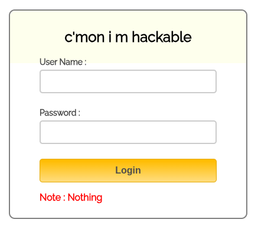
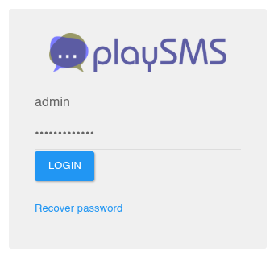

## Información Básica

### Técnicas vistas

- Web Enumeration
- Information Leakage
- Playing with esoteric languages - Ook! and Brainfuck
- Cracking Zip Password Protected Files
- PlaySMS Exploitation - 'import.php' Remote Code Execution [RCE]
- BufferOverflow 32 bits - Ret2libc [Privilege Escalation]

### Preparación

- eWPT
- Buffer Overflow

***

## Reconocimiento

### Nmap

Iniciaremos el escaneo de **Nmap** con la siguiente línea de comandos:

```bash wrap=false
nmap -p- --open -sS --min-rate 5000 -vvv -n -Pn 10.10.10.111 -oG nmap/allPorts 
```

| Parámetro           | Descripción                                                                                  |
| ------------------- | -------------------------------------------------------------------------------------------- |
| `-p-`               | Escanea **todos los puertos** (1-65535).                                                     |
| `--open`            | Muestra **solo puertos abiertos**.                                                           |
| `-sS`               | Escaneo **SYN** (rápido y sigiloso).                                                         |
| `--min-rate 5000`   | Envía al menos **5000 paquetes por segundo** para acelerar el escaneo.                       |
| `-vvv`              | Máxima **verbosidad**, muestra más detalles en tiempo real.                                  |
| `-n`                | Evita resolución DNS.                                                                        |
| `-Pn`               | Asume que el host está activo, **sin hacer ping** previo.                                    |
| `10.10.10.111`      | Dirección IP objetivo.                                                                       |
| `-oG nmap/allPorts` | Guarda la salida en formato **grepable** para procesar con herramientas como `grep` o `awk`. |

```txt wrap=false
PORT     STATE SERVICE      REASON
22/tcp   open  ssh          syn-ack ttl 63
139/tcp  open  netbios-ssn  syn-ack ttl 63
445/tcp  open  microsoft-ds syn-ack ttl 63
1880/tcp open  vsat-control syn-ack ttl 63
9999/tcp open  abyss        syn-ack ttl 63
```

Ahora con la función **extractPorts**, extraeremos los puertos abiertos y nos los copiaremos al clipboard para hacer un escaneo más profundo:

```bash title="Función de S4vitar"
extractPorts () {
	ports="$(cat $1 | grep -oP '\d{1,5}/open' | awk '{print $1}' FS='/' | xargs | tr ' ' ',')" 
	ip_address="$(cat $1 | grep -oP '\d{1,3}\.\d{1,3}\.\d{1,3}\.\d{1,3}' | sort -u | head -n 1)" 
	echo -e "\n[*] Extracting information...\n" > extractPorts.tmp
	echo -e "\t[*] IP Address: $ip_address" >> extractPorts.tmp
	echo -e "\t[*] Open ports: $ports\n" >> extractPorts.tmp
	echo $ports | tr -d '\n' | xclip -sel clip
	echo -e "[*] Ports copied to clipboard\n" >> extractPorts.tmp
	/bin/batcat --paging=never extractPorts.tmp
	rm extractPorts.tmp
}
```

```bash wrap=false
nmap -sVC -p22,139,445,1880,9999 10.10.10.111 -oN nmap/targeted
```

| Parámetro           | Descripción                                                                          |
| ------------------- | ------------------------------------------------------------------------------------ |
| `-sV`               | Detecta la **versión** de los servicios que están corriendo en los puertos abiertos. |
| `-C`                | Ejecuta **scripts NSE de detección de versiones y configuración**.                   |
| `-p`                | Escanea únicamente los puertos seleccionados.                                        |
| `10.10.10.111`      | Dirección IP objetivo.                                                               |
| `-oN nmap/targeted` | Guarda la salida en **formato normal** en el archivo indicado.                       |

```txt wrap=false
PORT     STATE SERVICE     VERSION
22/tcp   open  ssh         OpenSSH 7.2p2 Ubuntu 4ubuntu2.4 (Ubuntu Linux; protocol 2.0)
| ssh-hostkey: 
|   2048 87:7b:91:2a:0f:11:b6:57:1e:cb:9f:77:cf:35:e2:21 (RSA)
|   256 b7:9b:06:dd:c2:5e:28:44:78:41:1e:67:7d:1e:b7:62 (ECDSA)
|_  256 21:cf:16:6d:82:a4:30:c3:c6:9c:d7:38:ba:b5:02:b0 (ED25519)
139/tcp  open  netbios-ssn Samba smbd 3.X - 4.X (workgroup: WORKGROUP)
445/tcp  open  netbios-ssn Samba smbd 4.3.11-Ubuntu (workgroup: WORKGROUP)
1880/tcp open  http        Node.js (Express middleware)
|_http-title: Node-RED
9999/tcp open  http        nginx 1.10.3 (Ubuntu)
|_http-title: Welcome to nginx!
|_http-server-header: nginx/1.10.3 (Ubuntu)
Service Info: Host: FROLIC; OS: Linux; CPE: cpe:/o:linux:linux_kernel

Host script results:
| smb-security-mode: 
|   account_used: guest
|   authentication_level: user
|   challenge_response: supported
|_  message_signing: disabled (dangerous, but default)
| smb-os-discovery: 
|   OS: Windows 6.1 (Samba 4.3.11-Ubuntu)
|   Computer name: frolic
|   NetBIOS computer name: FROLIC\x00
|   Domain name: \x00
|   FQDN: frolic
|_  System time: 2025-09-07T03:28:05+05:30
| smb2-time: 
|   date: 2025-09-06T21:58:05
|_  start_date: N/A
|_nbstat: NetBIOS name: FROLIC, NetBIOS user: <unknown>, NetBIOS MAC: <unknown> (unknown)
|_clock-skew: mean: -1h49m59s, deviation: 3h10m30s, median: 0s
| smb2-security-mode: 
|   3:1:1: 
|_    Message signing enabled but not required
```

### Whatweb

Viendo que tiene 2 servicios `http` disponibles, vamos a hacer un reconocimiento con esta herramienta:

```bash wrap=false
❯ whatweb http://10.10.10.111:1880
http://10.10.10.111:1880 [200 OK] Bootstrap, Country[RESERVED][ZZ], HTML5, IP[10.10.10.111], Script[text/x-red], Title[Node-RED], X-Powered-By[Express], X-UA-Compatible[IE=edge]
❯ whatweb http://10.10.10.111:9999
http://10.10.10.111:9999 [200 OK] Country[RESERVED][ZZ], HTML5, HTTPServer[Ubuntu Linux][nginx/1.10.3 (Ubuntu)], IP[10.10.10.111], Title[Welcome to nginx!], nginx[1.10.3]
```

### Wfuzz

También sería interesante hacer un poco de fuzzing a ver si encontramos algo interesante:

```bash wrap=false

❯ wfuzz -c -L --hc=404 -w /usr/share/wordlists/seclists/Discovery/Web-Content/directory-list-2.3-medium.txt http://10.10.10.111:9999/FUZZ
 /usr/lib/python3/dist-packages/wfuzz/__init__.py:34: UserWarning:Pycurl is not compiled against Openssl. Wfuzz might not work correctly when fuzzing SSL sites. Check Wfuzz's documentation for more information.
********************************************************
* Wfuzz 3.1.0 - The Web Fuzzer                         *
********************************************************

Target: http://10.10.10.111:9999/FUZZ
Total requests: 220545

=====================================================================
ID           Response   Lines    Word       Chars       Payload                                                                                                                
=====================================================================

000000245:   200        25 L     63 W       634 Ch      "admin"                                                                                                                
000000597:   200        1006 L   5031 W     84161 Ch    "test"                                                                                                                 
000000820:   403        7 L      11 W       178 Ch      "dev"                                                                                                                  
000001612:   200        3 L      3 W        28 Ch       "backup"                                                                                                               
000011647:   403        7 L      11 W       178 Ch      "loop" 
```

Si miramos un poco la ruta `/admin`



Vemos un panel de login, viendo el **código fuente** de esta página vemos un archivo `javascript` algo turbio:

```js title="/admin/js/login.js" wrap=false
var attempt = 3; // Variable to count number of attempts.

// Below function Executes on click of login button.
function validate() {
    var username = document.getElementById("username").value;
    var password = document.getElementById("password").value;

    if (username == "admin" && password == "superduperlooperpassword_lol") {
        alert("Login successfully");
        window.location = "success.html"; // Redirecting to other page.
        return false;
    } else {
        attempt--; // Decrementing by one.
        alert("You have left " + attempt + " attempt(s).");

        // Disabling fields after 3 attempts.
        if (attempt == 0) {
            document.getElementById("username").disabled = true;
            document.getElementById("password").disabled = true;
            document.getElementById("submit").disabled = true;
            return false;
        }
    }
}
```

Si probamos esas credenciales nos logueamos con éxito, ahora la página muestra lo siguiente:

```txt title="/admin/success.html"
..... ..... ..... .!?!! .?... ..... ..... ...?. ?!.?. ..... ..... ..... ..... ..... ..!.? ..... ..... .!?!! .?... ..... ..?.? !.?.. ..... ..... ....! ..... ..... .!.?. ..... .!?!! .?!!! !!!?. ?!.?! !!!!! !...! ..... ..... .!.!! !!!!! !!!!! !!!.? ..... ..... ..... ..!?! !.?!! !!!!! !!!!! !!!!? .?!.? !!!!! !!!!! !!!!! .?... ..... ..... ....! ?!!.? ..... ..... ..... .?.?! .?... ..... ..... ...!. !!!!! !!.?. ..... .!?!! .?... ...?. ?!.?. ..... ..!.? ..... ..!?! !.?!! !!!!? .?!.? !!!!! !!!!. ?.... ..... ..... ...!? !!.?! !!!!! !!!!! !!!!! ?.?!. ?!!!! !!!!! !!.?. ..... ..... ..... .!?!! .?... ..... ..... ...?. ?!.?. ..... !.... ..... ..!.! !!!!! !.!!! !!... ..... ..... ....! .?... ..... ..... ....! ?!!.? !!!!! !!!!! !!!!! !?.?! .?!!! !!!!! !!!!! !!!!! !!!!! .?... ....! ?!!.? ..... .?.?! .?... ..... ....! .?... ..... ..... ..!?! !.?.. ..... ..... ..?.? !.?.. !.?.. ..... ..!?! !.?.. ..... .?.?! .?... .!.?. ..... .!?!! .?!!! !!!?. ?!.?! !!!!! !!!!! !!... ..... ...!. ?.... ..... !?!!. ?!!!! !!!!? .?!.? !!!!! !!!!! !!!.? ..... ..!?! !.?!! !!!!? .?!.? !!!.! !!!!! !!!!! !!!!! !.... ..... ..... ..... !.!.? ..... ..... .!?!! .?!!! !!!!! !!?.? !.?!! !.?.. ..... ....! ?!!.? ..... ..... ?.?!. ?.... ..... ..... ..!.. ..... ..... .!.?. ..... ...!? !!.?! !!!!! !!?.? !.?!! !!!.? ..... ..!?! !.?!! !!!!? .?!.? !!!!! !!.?. ..... ...!? !!.?. ..... ..?.? !.?.. !.!!! !!!!! !!!!! !!!!! !.?.. ..... ..!?! !.?.. ..... .?.?! .?... .!.?. ..... ..... ..... .!?!! .?!!! !!!!! !!!!! !!!?. ?!.?! !!!!! !!!!! !!.!! !!!!! ..... ..!.! !!!!! !.?.
```

Esto de primeras parece un lenguaje `esotérico`.

:::important
Un lenguaje de programación `esotérico` es un tipo de lenguaje creado con fines experimentales, artísticos o humorísticos, más que para resolver problemas prácticos. Suelen tener reglas extrañas, sintaxis poco convencional o limitaciones extremas que los hacen difíciles de usar, pero justamente eso los convierte en un reto intelectual y en una forma de expresión creativa dentro de la programación.
:::

Ahora deberíamos tratar de identificar que lenguaje es. Buscando en Internet, podríamos intuir que se trata del lenguaje [Ook](http://ast.wikipedia.org/wiki/Ook!), ya que la sintáxis es parecida.

Podríamos probar a convertirlo y ver si muestra algo:

```bash
❯ /usr/bin/cat data | tr -d ' ' | sed 's/\./Ook\./g' | sed 's/!/Ook!/g' | sed 's/?/Ook?/g'
Ook.Ook.Ook.Ook.Ook.Ook.Ook.Ook.Ook.Ook.Ook.Ook.Ook.Ook.Ook.Ook.Ook!Ook?Ook!Ook!Ook.Ook?Ook.Ook.Ook.Ook.Ook.Ook.Ook.Ook.Ook.Ook.Ook.Ook.Ook.Ook.Ook.Ook.Ook?Ook.Ook?Ook!Ook.Ook?Ook.Ook.Ook.Ook.Ook.Ook.Ook.Ook.Ook.Ook.Ook.Ook.Ook.Ook.Ook.Ook.Ook.Ook.Ook.Ook.Ook.Ook.Ook.Ook.Ook.Ook.Ook.Ook.Ook!Ook.Ook?Ook.Ook.Ook.Ook.Ook.Ook.Ook.Ook.Ook.Ook.Ook.Ook!Ook?Ook!Ook!Ook.Ook?Ook.Ook.Ook.Ook.Ook.Ook.Ook.Ook.Ook.Ook.Ook?Ook.Ook?Ook!Ook.Ook?Ook.Ook.Ook.Ook.Ook.Ook.Ook.Ook.Ook.Ook.Ook.Ook.Ook.Ook.Ook.Ook.Ook!Ook.Ook.Ook.Ook.Ook.Ook.Ook.Ook.Ook.Ook.Ook.Ook!Ook.Ook?Ook.Ook.Ook.Ook.Ook.Ook.Ook.Ook!Ook?Ook!Ook!Ook.Ook?Ook!Ook!Ook!Ook!Ook!Ook!Ook?Ook.Ook?Ook!Ook.Ook?Ook!Ook!Ook!Ook!Ook!Ook!Ook!Ook.Ook.Ook.Ook!Ook.Ook.Ook.Ook.Ook.Ook.Ook.Ook.Ook.Ook.Ook.Ook!Ook.Ook!Ook!Ook!Ook!Ook!Ook!Ook!Ook!Ook!Ook!Ook!Ook!Ook!Ook!Ook!Ook.Ook?Ook.Ook.Ook.Ook.Ook.Ook.Ook.Ook.Ook.Ook.Ook.Ook.Ook.Ook.Ook.Ook.Ook.Ook!Ook?Ook!Ook!Ook.Ook?Ook!Ook!Ook!Ook!Ook!Ook!Ook!Ook!Ook!Ook!Ook!Ook!Ook!Ook!Ook!Ook!Ook?Ook.Ook?Ook!Ook.Ook?Ook!Ook!Ook!Ook!Ook!Ook!Ook!Ook!Ook!Ook!Ook!Ook!Ook!Ook!Ook!Ook.Ook?Ook.Ook.Ook.Ook.Ook.Ook.Ook.Ook.Ook.Ook.Ook.Ook.Ook.Ook.Ook.Ook.Ook.Ook!Ook?Ook!Ook!Ook.Ook?Ook.Ook.Ook.Ook.Ook.Ook.Ook.Ook.Ook.Ook.Ook.Ook.Ook.Ook.Ook.Ook.Ook?Ook.Ook?Ook!Ook.Ook?Ook.Ook.Ook.Ook.Ook.Ook.Ook.Ook.Ook.Ook.Ook.Ook.Ook.Ook.Ook.Ook.Ook!Ook.Ook!Ook!Ook!Ook!Ook!Ook!Ook!Ook.Ook?Ook.Ook.Ook.Ook.Ook.Ook.Ook.Ook!Ook?Ook!Ook!Ook.Ook?Ook.Ook.Ook.Ook.Ook.Ook.Ook?Ook.Ook?Ook!Ook.Ook?Ook.Ook.Ook.Ook.Ook.Ook.Ook.Ook.Ook!Ook.Ook?Ook.Ook.Ook.Ook.Ook.Ook.Ook.Ook!Ook?Ook!Ook!Ook.Ook?Ook!Ook!Ook!Ook!Ook!Ook!Ook?Ook.Ook?Ook!Ook.Ook?Ook!Ook!Ook!Ook!Ook!Ook!Ook!Ook!Ook!Ook.Ook?Ook.Ook.Ook.Ook.Ook.Ook.Ook.Ook.Ook.Ook.Ook.Ook.Ook.Ook.Ook.Ook.Ook.Ook!Ook?Ook!Ook!Ook.Ook?Ook!Ook!Ook!Ook!Ook!Ook!Ook!Ook!Ook!Ook!Ook!Ook!Ook!Ook!Ook!Ook!Ook?Ook.Ook?Ook!Ook.Ook?Ook!Ook!Ook!Ook!Ook!Ook!Ook!Ook!Ook!Ook!Ook!Ook.Ook?Ook.Ook.Ook.Ook.Ook.Ook.Ook.Ook.Ook.Ook.Ook.Ook.Ook.Ook.Ook.Ook.Ook.Ook!Ook?Ook!Ook!Ook.Ook?Ook.Ook.Ook.Ook.Ook.Ook.Ook.Ook.Ook.Ook.Ook.Ook.Ook.Ook.Ook.Ook.Ook?Ook.Ook?Ook!Ook.Ook?Ook.Ook.Ook.Ook.Ook.Ook.Ook!Ook.Ook.Ook.Ook.Ook.Ook.Ook.Ook.Ook.Ook.Ook.Ook!Ook.Ook!Ook!Ook!Ook!Ook!Ook!Ook!Ook.Ook!Ook!Ook!Ook!Ook!Ook.Ook.Ook.Ook.Ook.Ook.Ook.Ook.Ook.Ook.Ook.Ook.Ook.Ook.Ook.Ook.Ook.Ook!Ook.Ook?Ook.Ook.Ook.Ook.Ook.Ook.Ook.Ook.Ook.Ook.Ook.Ook.Ook.Ook.Ook.Ook.Ook.Ook!Ook?Ook!Ook!Ook.Ook?Ook!Ook!Ook!Ook!Ook!Ook!Ook!Ook!Ook!Ook!Ook!Ook!Ook!Ook!Ook!Ook!Ook?Ook.Ook?Ook!Ook.Ook?Ook!Ook!Ook!Ook!Ook!Ook!Ook!Ook!Ook!Ook!Ook!Ook!Ook!Ook!Ook!Ook!Ook!Ook!Ook!Ook!Ook!Ook!Ook!Ook.Ook?Ook.Ook.Ook.Ook.Ook.Ook.Ook.Ook!Ook?Ook!Ook!Ook.Ook?Ook.Ook.Ook.Ook.Ook.Ook.Ook?Ook.Ook?Ook!Ook.Ook?Ook.Ook.Ook.Ook.Ook.Ook.Ook.Ook.Ook.Ook.Ook.Ook.Ook!Ook.Ook?Ook.Ook.Ook.Ook.Ook.Ook.Ook.Ook.Ook.Ook.Ook.Ook.Ook.Ook.Ook.Ook!Ook?Ook!Ook!Ook.Ook?Ook.Ook.Ook.Ook.Ook.Ook.Ook.Ook.Ook.Ook.Ook.Ook.Ook.Ook.Ook?Ook.Ook?Ook!Ook.Ook?Ook.Ook.Ook!Ook.Ook?Ook.Ook.Ook.Ook.Ook.Ook.Ook.Ook.Ook.Ook!Ook?Ook!Ook!Ook.Ook?Ook.Ook.Ook.Ook.Ook.Ook.Ook.Ook.Ook?Ook.Ook?Ook!Ook.Ook?Ook.Ook.Ook.Ook.Ook!Ook.Ook?Ook.Ook.Ook.Ook.Ook.Ook.Ook.Ook!Ook?Ook!Ook!Ook.Ook?Ook!Ook!Ook!Ook!Ook!Ook!Ook?Ook.Ook?Ook!Ook.Ook?Ook!Ook!Ook!Ook!Ook!Ook!Ook!Ook!Ook!Ook!Ook!Ook!Ook!Ook.Ook.Ook.Ook.Ook.Ook.Ook.Ook.Ook.Ook.Ook.Ook!Ook.Ook?Ook.Ook.Ook.Ook.Ook.Ook.Ook.Ook.Ook.Ook!Ook?Ook!Ook!Ook.Ook?Ook!Ook!Ook!Ook!Ook!Ook!Ook!Ook!Ook?Ook.Ook?Ook!Ook.Ook?Ook!Ook!Ook!Ook!Ook!Ook!Ook!Ook!Ook!Ook!Ook!Ook!Ook!Ook.Ook?Ook.Ook.Ook.Ook.Ook.Ook.Ook.Ook!Ook?Ook!Ook!Ook.Ook?Ook!Ook!Ook!Ook!Ook!Ook!Ook?Ook.Ook?Ook!Ook.Ook?Ook!Ook!Ook!Ook.Ook!Ook!Ook!Ook!Ook!Ook!Ook!Ook!Ook!Ook!Ook!Ook!Ook!Ook!Ook!Ook!Ook!Ook.Ook.Ook.Ook.Ook.Ook.Ook.Ook.Ook.Ook.Ook.Ook.Ook.Ook.Ook.Ook.Ook.Ook.Ook.Ook!Ook.Ook!Ook.Ook?Ook.Ook.Ook.Ook.Ook.Ook.Ook.Ook.Ook.Ook.Ook.Ook!Ook?Ook!Ook!Ook.Ook?Ook!Ook!Ook!Ook!Ook!Ook!Ook!Ook!Ook!Ook!Ook?Ook.Ook?Ook!Ook.Ook?Ook!Ook!Ook!Ook.Ook?Ook.Ook.Ook.Ook.Ook.Ook.Ook.Ook.Ook.Ook.Ook.Ook!Ook?Ook!Ook!Ook.Ook?Ook.Ook.Ook.Ook.Ook.Ook.Ook.Ook.Ook.Ook.Ook?Ook.Ook?Ook!Ook.Ook?Ook.Ook.Ook.Ook.Ook.Ook.Ook.Ook.Ook.Ook.Ook.Ook.Ook.Ook.Ook.Ook.Ook!Ook.Ook.Ook.Ook.Ook.Ook.Ook.Ook.Ook.Ook.Ook.Ook.Ook.Ook!Ook.Ook?Ook.Ook.Ook.Ook.Ook.Ook.Ook.Ook.Ook.Ook!Ook?Ook!Ook!Ook.Ook?Ook!Ook!Ook!Ook!Ook!Ook!Ook!Ook!Ook?Ook.Ook?Ook!Ook.Ook?Ook!Ook!Ook!Ook!Ook!Ook.Ook?Ook.Ook.Ook.Ook.Ook.Ook.Ook.Ook!Ook?Ook!Ook!Ook.Ook?Ook!Ook!Ook!Ook!Ook!Ook!Ook?Ook.Ook?Ook!Ook.Ook?Ook!Ook!Ook!Ook!Ook!Ook!Ook!Ook.Ook?Ook.Ook.Ook.Ook.Ook.Ook.Ook.Ook.Ook.Ook!Ook?Ook!Ook!Ook.Ook?Ook.Ook.Ook.Ook.Ook.Ook.Ook.Ook.Ook?Ook.Ook?Ook!Ook.Ook?Ook.Ook.Ook!Ook.Ook!Ook!Ook!Ook!Ook!Ook!Ook!Ook!Ook!Ook!Ook!Ook!Ook!Ook!Ook!Ook!Ook!Ook!Ook!Ook.Ook?Ook.Ook.Ook.Ook.Ook.Ook.Ook.Ook.Ook.Ook!Ook?Ook!Ook!Ook.Ook?Ook.Ook.Ook.Ook.Ook.Ook.Ook.Ook.Ook?Ook.Ook?Ook!Ook.Ook?Ook.Ook.Ook.Ook.Ook!Ook.Ook?Ook.Ook.Ook.Ook.Ook.Ook.Ook.Ook.Ook.Ook.Ook.Ook.Ook.Ook.Ook.Ook.Ook.Ook!Ook?Ook!Ook!Ook.Ook?Ook!Ook!Ook!Ook!Ook!Ook!Ook!Ook!Ook!Ook!Ook!Ook!Ook!Ook!Ook!Ook!Ook?Ook.Ook?Ook!Ook.Ook?Ook!Ook!Ook!Ook!Ook!Ook!Ook!Ook!Ook!Ook!Ook!Ook!Ook!Ook.Ook!Ook!Ook!Ook!Ook!Ook!Ook!Ook.Ook.Ook.Ook.Ook.Ook.Ook.Ook!Ook.Ook!Ook!Ook!Ook!Ook!Ook!Ook!Ook.Ook?Ook.
```

Y nos sale como resultado:

```txt
Nothing here check /asdiSIAJJ0QWE9JAS
```

```txt title='/asdiSIAJJ0QWE9JAS/'
UEsDBBQACQAIAMOJN00j/lsUsAAAAGkCAAAJABwAaW5kZXgucGhwVVQJAAOFfKdbhXynW3V4CwAB BAAAAAAEAAAAAF5E5hBKn3OyaIopmhuVUPBuC6m/U3PkAkp3GhHcjuWgNOL22Y9r7nrQEopVyJbs K1i6f+BQyOES4baHpOrQu+J4XxPATolb/Y2EU6rqOPKD8uIPkUoyU8cqgwNE0I19kzhkVA5RAmve EMrX4+T7al+fi/kY6ZTAJ3h/Y5DCFt2PdL6yNzVRrAuaigMOlRBrAyw0tdliKb40RrXpBgn/uoTj lurp78cmcTJviFfUnOM5UEsHCCP+WxSwAAAAaQIAAFBLAQIeAxQACQAIAMOJN00j/lsUsAAAAGkC AAAJABgAAAAAAAEAAACkgQAAAABpbmRleC5waHBVVAUAA4V8p1t1eAsAAQQAAAAABAAAAABQSwUG AAAAAAEAAQBPAAAAAwEAAAAA
```

Esto parece `Base64`, vamos a decodificarlo:

```bash wrap=false
❯ echo 'UEsDBBQACQAIAMOJN00j/lsUsAAAAGkCAAAJABwAaW5kZXgucGhwVVQJAAOFfKdbhXynW3V4CwAB BAAAAAAEAAAAAF5E5hBKn3OyaIopmhuVUPBuC6m/U3PkAkp3GhHcjuWgNOL22Y9r7nrQEopVyJbs K1i6f+BQyOES4baHpOrQu+J4XxPATolb/Y2EU6rqOPKD8uIPkUoyU8cqgwNE0I19kzhkVA5RAmve EMrX4+T7al+fi/kY6ZTAJ3h/Y5DCFt2PdL6yNzVRrAuaigMOlRBrAyw0tdliKb40RrXpBgn/uoTj lurp78cmcTJviFfUnOM5UEsHCCP+WxSwAAAAaQIAAFBLAQIeAxQACQAIAMOJN00j/lsUsAAAAGkC AAAJABgAAAAAAAEAAACkgQAAAABpbmRleC5waHBVVAUAA4V8p1t1eAsAAQQAAAAABAAAAABQSwUG AAAAAAEAAQBPAAAAAwEAAAAA' | base64 -d | xxd
base64: entrada inválida
00000000: 504b 0304 1400 0900 0800 c389 374d 23fe  PK..........7M#.
00000010: 5b14 b000 0000 6902 0000 0900 1c00 696e  [.....i.......in
00000020: 6465 782e 7068 7055 5409 0003 857c a75b  dex.phpUT....|.[
00000030: 857c a75b 7578 0b00 01                   .|.[ux...
```

Si buscamos por la firma de archivo `50 4b 03 04` en wikipeda:


Parece que es un **comprimido**, vamos a intentar descomprimirlo:

```bash wrap=false
❯ curl -s -X GET 'http://10.10.10.111:9999/asdiSIAJJ0QWE9JAS/' | tr -d '\n' | base64 -d > data.zip
❯ unzip data.zip
Archive:  data.zip
[data.zip] index.php password:
```

Parece que está protegido por contraseña, vamos a intentar crackearla con `zip2john`:

```bash wrap=false
❯ zip2john data.zip > hash
ver 2.0 efh 5455 efh 7875 data.zip/index.php PKZIP Encr: TS_chk, cmplen=176, decmplen=617, crc=145BFE23 ts=89C3 cs=89c3 type=8
❯ cat hash
───────┬────────────────────────────────────────────────────────────────────────────────────────────────────────────────────────────────────────────────────────────────────────────────
       │ File: hash
───────┼────────────────────────────────────────────────────────────────────────────────────────────────────────────────────────────────────────────────────────────────────────────────
   1   │ data.zip/index.php:$pkzip$1*1*2*0*b0*269*145bfe23*0*43*8*b0*89c3*5e44e6104a9f73b2688a299a1b9550f06e0ba9bf5373e4024a771a11dc8ee5a034e2f6d98f6bee7ad0128a55c896ec2b58ba7fe050c8e1
       │ 12e1b687a4ead0bbe2785f13c04e895bfd8d8453aaea38f283f2e20f914a3253c72a830344d08d7d933864540e51026bde10cad7e3e4fb6a5f9f8bf918e994c027787f6390c216dd8f74beb2373551ac0b9a8a030e95106
       │ b032c34b5d96229be3446b5e90609ffba84e396eae9efc72671326f8857d49ce339*$/pkzip$:index.php:data.zip::data.zip
───────┴────────────────────────────────────────────────────────────────────────────────────────────────────────────────────────────────────────────────────────────────────────────────
❯ john --wordlist=/usr/share/wordlists/rockyou.txt hash
Using default input encoding: UTF-8
Loaded 1 password hash (PKZIP [32/64])
Will run 4 OpenMP threads
Press 'q' or Ctrl-C to abort, almost any other key for status
password         (data.zip/index.php)     
1g 0:00:00:00 DONE (2025-09-09 09:11) 100.0g/s 819200p/s 819200c/s 819200C/s 123456..whitetiger
Use the "--show" option to display all of the cracked passwords reliably
Session completed. 
```

```txt wrap=false title='index.php'
4b7973724b7973674b7973724b7973675779302b4b7973674b7973724b7973674b79737250463067506973724b7973674b7934744c5330674c5330754b7973674b7973724b7973674c6a77720d0a4b7973675779302b4b7973674b7a78645069734b4b797375504373674b7974624c5434674c53307450463067506930744c5330674c5330754c5330674c5330744c5330674c6a77724b7973670d0a4b317374506973674b79737250463067506973724b793467504373724b3173674c5434744c53304b5046302b4c5330674c6a77724b7973675779302b4b7973674b7a7864506973674c6930740d0a4c533467504373724b3173674c5434744c5330675046302b4c5330674c5330744c533467504373724b7973675779302b4b7973674b7973385854344b4b7973754c6a776743673d3d0d0a
```

Eso parece `hexadecimal` vamos a decodificarlo:

```bash wrap=false
❯ cat index.php | xxd -ps -r
KysrKysgKysrKysgWy0+KysgKysrKysgKysrPF0gPisrKysgKy4tLS0gLS0uKysgKysrKysgLjwr
KysgWy0+KysgKzxdPisKKysuPCsgKytbLT4gLS0tPF0gPi0tLS0gLS0uLS0gLS0tLS0gLjwrKysg
K1stPisgKysrPF0gPisrKy4gPCsrK1sgLT4tLS0KPF0+LS0gLjwrKysgWy0+KysgKzxdPisgLi
```

Y eso es de nuevo `Base 64`:

```bash wrap=false
❯ cat index_data | tr -d '\n' | base64 -d; echo
+++++ +++++ [->++ +++++ +++<] >++++ +.--- --.++ +++++ .<+++ [->++ +<]>+
++.<+ ++[-> ---<] >---- --.-- ----- .<+++ +[->+ +++<] >+++. <+++[ ->---
<]>-- .<+++ [->++ +<]>+ .---. <+++[ ->--- <]>-- ----. <++++ [->++ ++<]>
++..< 
```

De nuevo eso es un lenguaje `esotérico` en concreto `Brainfuck`, esto es lo que nos devuelve:

```txt
idkwhatispass
```

Esto parece una contraseña. A partir de aquí podríamos volver a intentar a hacer ´fuzzing´ por ejemplo sobre el directorio `dev`:

```bash wrap=false
❯ wfuzz -c -L --hc=404 -t 200 -w /usr/share/wordlists/seclists/Discovery/Web-Content/directory-list-2.3-medium.txt http://10.10.10.111:9999/dev/FUZZ
 /usr/lib/python3/dist-packages/wfuzz/__init__.py:34: UserWarning:Pycurl is not compiled against Openssl. Wfuzz might not work correctly when fuzzing SSL sites. Check Wfuzz's documentation for more information.
********************************************************
* Wfuzz 3.1.0 - The Web Fuzzer                         *
********************************************************

Target: http://10.10.10.111:9999/dev/FUZZ
Total requests: 220545

=====================================================================
ID           Response   Lines    Word       Chars       Payload                                                                                                                
=====================================================================

000000597:   200        1 L      1 W        5 Ch        "test"                                                                                                                 
000001612:   200        3 L      1 W        11 Ch       "backup" 
```

```txt title='/dev/backup'
/playsms
```



Si probamos las credenciales `admin:idkwhatispass` nos podemos loguear.

[Pwned!](https://labs.hackthebox.com/achievement/machine/1992274/148)

---